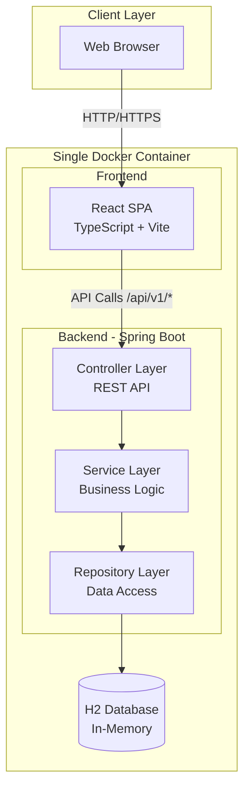
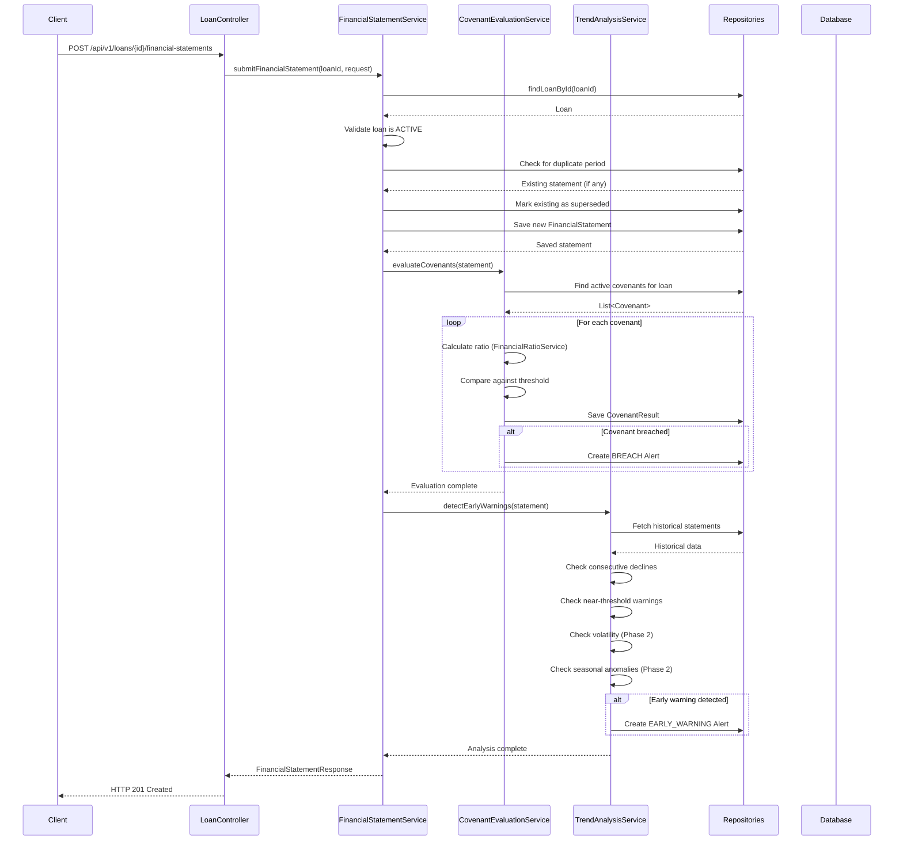
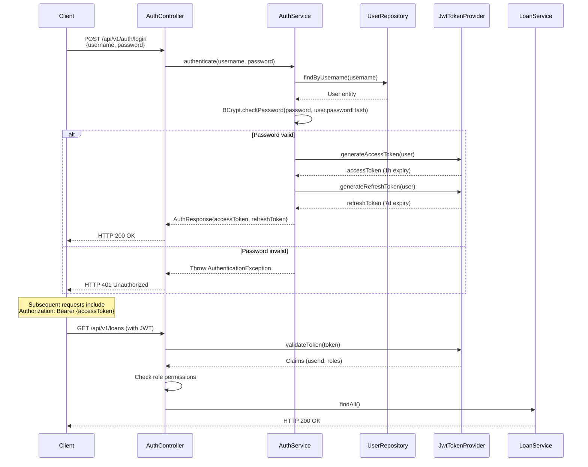
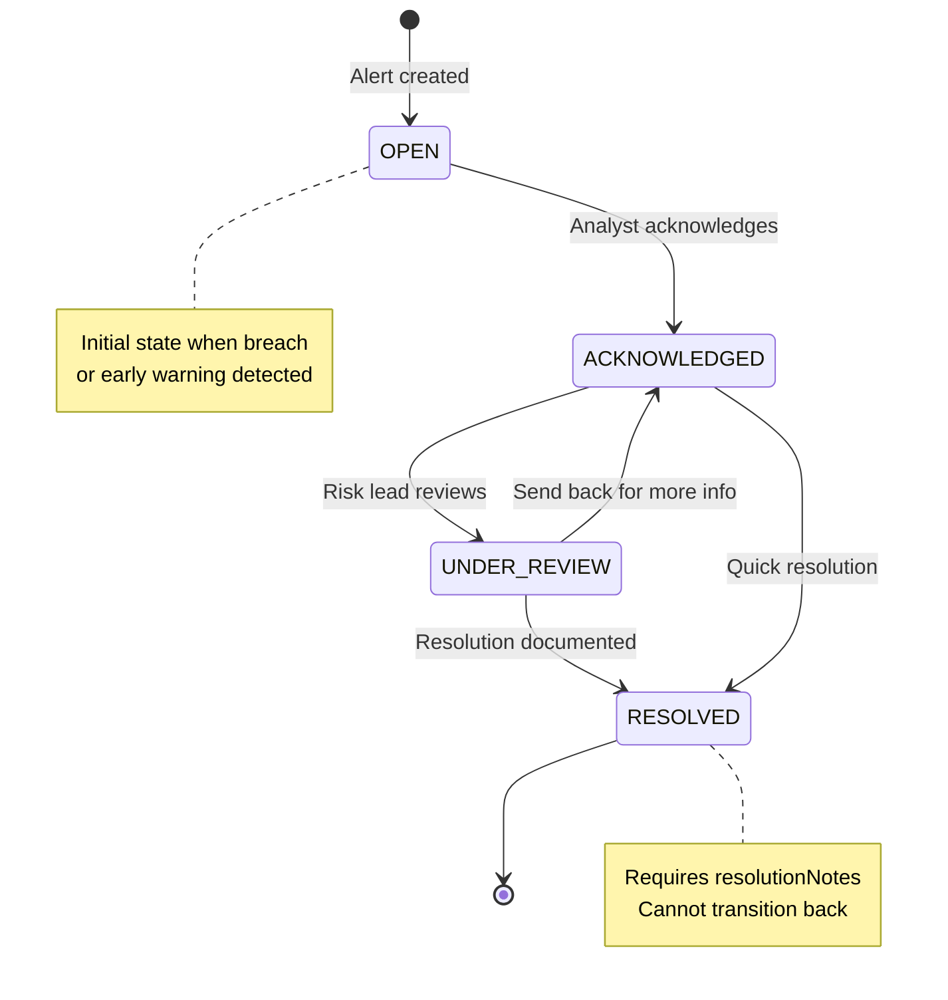
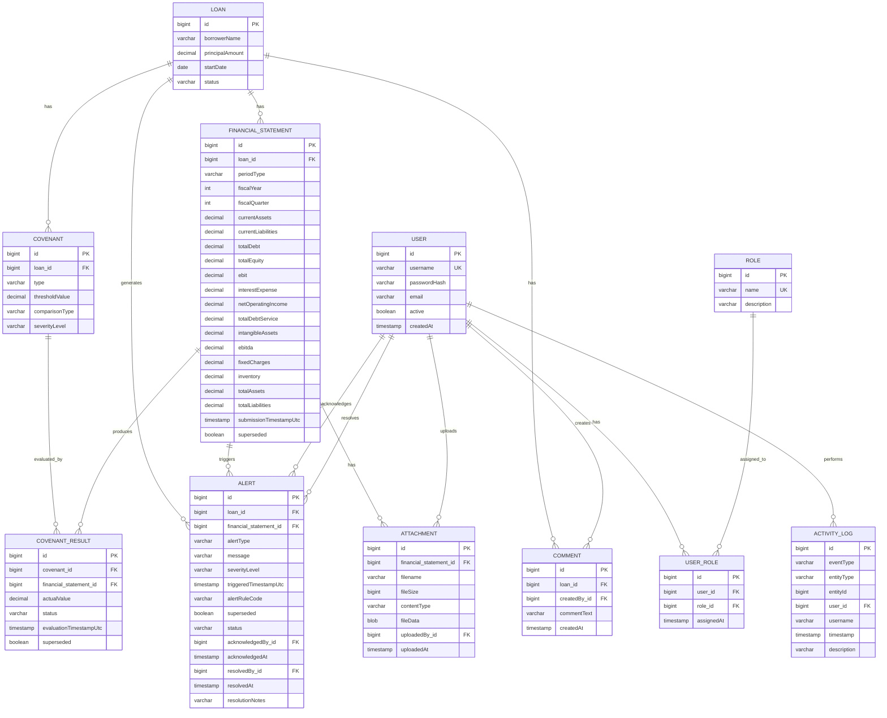
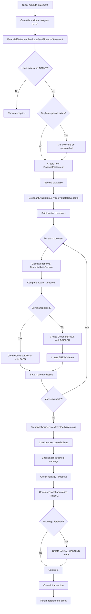
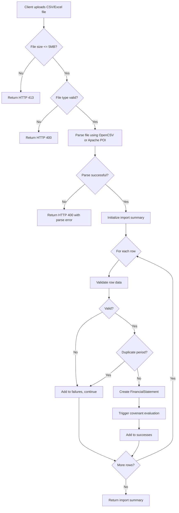

# CovenantIQ Technical Design Document

## Overview

CovenantIQ is a commercial loan covenant monitoring system that automates compliance tracking, early warning detection, and portfolio risk analysis for financial institutions. The system serves credit risk analysts, risk leads, and administrators who monitor commercial loan portfolios for covenant compliance and financial distress signals.

### System Purpose

The system addresses the challenge of manually monitoring covenant compliance across large loan portfolios by:
- Automating financial ratio calculations and covenant evaluations
- Detecting early warning signals before covenant breaches occur
- Providing portfolio-wide risk aggregation and analytics
- Maintaining audit trails and collaboration features for risk teams

### Phase 1 (Implemented)

Phase 1 delivered core functionality including:
- Loan and covenant management with CRUD operations
- Financial statement submission with automatic covenant evaluation
- Breach detection and early warning alerts (consecutive declines, near-threshold warnings)
- Risk summary calculations and trend analysis
- React frontend with mock authentication
- Single Docker container deployment with H2 database

### Phase 2 (Planned)

Phase 2 expands the system with enterprise features:
- JWT authentication with Spring Security and role-based access control (ANALYST, RISK_LEAD, ADMIN)
- Alert lifecycle management (OPEN → ACKNOWLEDGED → UNDER_REVIEW → RESOLVED)
- Six additional covenant types (DSCR, Interest Coverage, Tangible Net Worth, Debt-to-EBITDA, Fixed Charge Coverage, Quick Ratio)
- Enhanced early warning detection (volatility analysis, seasonal anomaly detection)
- Portfolio-wide risk aggregation across all active loans
- Bulk import via CSV/Excel for historical financial statements
- Document attachment storage (PDF financial statements as database blobs)
- Collaboration features (loan comments, activity logging)
- CSV export for alerts and covenant results
- Structured JSON logging with correlation IDs
- Health check endpoint for monitoring


### Technology Stack

**Backend:**
- Java 21 LTS
- Spring Boot 3.x (Spring Web, Spring Data JPA, Spring Security for Phase 2)
- H2 Database (in-memory for demo, design supports PostgreSQL/MySQL migration)
- BigDecimal for all financial calculations with HALF_UP rounding to 4 decimal places
- OpenAPI/Swagger for API documentation
- Apache POI for Excel parsing (Phase 2)
- OpenCSV for CSV parsing (Phase 2)
- JWT (jjwt library) for authentication (Phase 2)
- BCrypt for password hashing (Phase 2)

**Frontend:**
- React 18 with TypeScript
- Vite for build tooling
- Tailwind CSS for styling
- Recharts for data visualization
- Axios for HTTP client
- React Router for navigation

**Deployment:**
- Single Docker container
- Spring Boot serves both REST API and static frontend assets
- Docker Compose for orchestration

### Design Principles

1. **Layered Architecture**: Clear separation between controller, service, repository, domain, and DTO layers
2. **Transactional Integrity**: Financial statement submission and covenant evaluation execute atomically
3. **Precision**: BigDecimal arithmetic with HALF_UP rounding to 4 decimal places for all financial calculations
4. **Immutability**: Financial statements and covenant results are superseded rather than deleted to maintain audit trail
5. **UTC Timestamps**: All temporal data stored in UTC (OffsetDateTime)
6. **RFC7807 Error Handling**: Consistent problem+json error responses
7. **Stateless API**: JWT-based authentication enables horizontal scaling (Phase 2)
8. **Role-Based Security**: Authorization enforced at service layer (Phase 2)

## Architecture

### High-Level Architecture



### Layered Architecture

**Controller Layer** (`com.covenantiq.controller`)
- Handles HTTP requests and responses
- Validates request DTOs using Jakarta Bean Validation
- Maps domain objects to response DTOs
- Enforces authentication and authorization (Phase 2)
- Returns RFC7807 problem+json for errors

**Service Layer** (`com.covenantiq.service`)
- Implements business logic and orchestration
- Manages transactions with @Transactional
- Coordinates between multiple repositories
- Enforces business rules and constraints
- Throws domain-specific exceptions

**Repository Layer** (`com.covenantiq.repository`)
- Extends Spring Data JPA repositories
- Provides custom query methods using JPQL
- Handles database interactions

**Domain Layer** (`com.covenantiq.domain`)
- JPA entities representing database tables
- Bidirectional relationships with cascade operations
- No business logic (anemic domain model)

**DTO Layer** (`com.covenantiq.dto`)
- Request DTOs for API inputs with validation annotations
- Response DTOs for API outputs
- Decouples API contract from domain model

**Exception Layer** (`com.covenantiq.exception`)
- Custom exceptions: ResourceNotFoundException, ConflictException, UnprocessableEntityException
- GlobalExceptionHandler with @ControllerAdvice for centralized error handling
- RFC7807 ProblemDetail responses

### Request Flow: Financial Statement Submission




### Authentication Flow (Phase 2)



### Alert Lifecycle Management (Phase 2)



## Components and Interfaces

### Domain Entities

#### Loan (Phase 1)
```java
@Entity
@Table(name = "loans")
public class Loan {
    @Id @GeneratedValue
    private Long id;
    
    @Column(nullable = false)
    private String borrowerName;
    
    @Column(nullable = false, precision = 19, scale = 4)
    private BigDecimal principalAmount;
    
    @Column(nullable = false)
    private LocalDate startDate;
    
    @Enumerated(EnumType.STRING)
    @Column(nullable = false)
    private LoanStatus status; // ACTIVE, CLOSED, PAID_OFF
    
    @OneToMany(mappedBy = "loan", cascade = ALL, orphanRemoval = true)
    private List<Covenant> covenants;
    
    @OneToMany(mappedBy = "loan", cascade = ALL, orphanRemoval = true)
    private List<FinancialStatement> financialStatements;
    
    @OneToMany(mappedBy = "loan", cascade = ALL, orphanRemoval = true)
    private List<Alert> alerts;
}
```

#### Covenant (Phase 1)
```java
@Entity
@Table(name = "covenants",
    uniqueConstraints = @UniqueConstraint(columnNames = {"loan_id", "type"}))
public class Covenant {
    @Id @GeneratedValue
    private Long id;
    
    @ManyToOne(optional = false)
    private Loan loan;
    
    @Enumerated(EnumType.STRING)
    @Column(nullable = false)
    private CovenantType type; // CURRENT_RATIO, DEBT_TO_EQUITY, DSCR, etc.
    
    @Column(nullable = false, precision = 19, scale = 6)
    private BigDecimal thresholdValue;
    
    @Enumerated(EnumType.STRING)
    @Column(nullable = false)
    private ComparisonType comparisonType; // GREATER_THAN_EQUAL, LESS_THAN_EQUAL
    
    @Enumerated(EnumType.STRING)
    @Column(nullable = false)
    private SeverityLevel severityLevel; // LOW, MEDIUM, HIGH
}
```


#### FinancialStatement (Phase 1 + Phase 2 Extensions)
```java
@Entity
@Table(name = "financial_statements")
public class FinancialStatement {
    @Id @GeneratedValue
    private Long id;
    
    @ManyToOne(optional = false)
    private Loan loan;
    
    @Enumerated(EnumType.STRING)
    @Column(nullable = false)
    private PeriodType periodType; // QUARTERLY, ANNUAL
    
    @Column(nullable = false)
    private Integer fiscalYear;
    
    @Column
    private Integer fiscalQuarter; // 1-4, null for ANNUAL
    
    // Phase 1 fields
    @Column(nullable = false, precision = 19, scale = 4)
    private BigDecimal currentAssets;
    
    @Column(nullable = false, precision = 19, scale = 4)
    private BigDecimal currentLiabilities;
    
    @Column(nullable = false, precision = 19, scale = 4)
    private BigDecimal totalDebt;
    
    @Column(nullable = false, precision = 19, scale = 4)
    private BigDecimal totalEquity;
    
    @Column(nullable = false, precision = 19, scale = 4)
    private BigDecimal ebit;
    
    @Column(nullable = false, precision = 19, scale = 4)
    private BigDecimal interestExpense;
    
    // Phase 2 additional fields for expanded covenant types
    @Column(precision = 19, scale = 4)
    private BigDecimal netOperatingIncome;
    
    @Column(precision = 19, scale = 4)
    private BigDecimal totalDebtService;
    
    @Column(precision = 19, scale = 4)
    private BigDecimal intangibleAssets;
    
    @Column(precision = 19, scale = 4)
    private BigDecimal ebitda;
    
    @Column(precision = 19, scale = 4)
    private BigDecimal fixedCharges;
    
    @Column(precision = 19, scale = 4)
    private BigDecimal inventory;
    
    @Column(precision = 19, scale = 4)
    private BigDecimal totalAssets;
    
    @Column(precision = 19, scale = 4)
    private BigDecimal totalLiabilities;
    
    @Column(nullable = false)
    private OffsetDateTime submissionTimestampUtc;
    
    @Column(nullable = false)
    private boolean superseded = false;
}
```

#### CovenantResult (Phase 1)
```java
@Entity
@Table(name = "covenant_results")
public class CovenantResult {
    @Id @GeneratedValue
    private Long id;
    
    @ManyToOne(optional = false)
    private Covenant covenant;
    
    @ManyToOne(optional = false)
    private FinancialStatement financialStatement;
    
    @Column(nullable = false, precision = 19, scale = 4)
    private BigDecimal actualValue;
    
    @Enumerated(EnumType.STRING)
    @Column(nullable = false)
    private CovenantResultStatus status; // PASS, BREACH
    
    @Column(nullable = false)
    private OffsetDateTime evaluationTimestampUtc;
    
    @Column(nullable = false)
    private boolean superseded = false;
}
```


#### Alert (Phase 1 + Phase 2 Extensions)
```java
@Entity
@Table(name = "alerts")
public class Alert {
    @Id @GeneratedValue
    private Long id;
    
    @ManyToOne(optional = false)
    private Loan loan;
    
    @ManyToOne(optional = false)
    private FinancialStatement financialStatement;
    
    @Enumerated(EnumType.STRING)
    @Column(nullable = false)
    private AlertType alertType; // BREACH, EARLY_WARNING
    
    @Column(nullable = false, length = 500)
    private String message;
    
    @Enumerated(EnumType.STRING)
    @Column(nullable = false)
    private SeverityLevel severityLevel;
    
    @Column(nullable = false)
    private OffsetDateTime triggeredTimestampUtc;
    
    @Column(nullable = false)
    private String alertRuleCode; // e.g., "CONSECUTIVE_DECLINE", "NEAR_THRESHOLD"
    
    @Column(nullable = false)
    private boolean superseded = false;
    
    // Phase 2 additions for alert lifecycle
    @Enumerated(EnumType.STRING)
    @Column(nullable = false)
    private AlertStatus status = AlertStatus.OPEN; // OPEN, ACKNOWLEDGED, UNDER_REVIEW, RESOLVED
    
    @ManyToOne
    private User acknowledgedBy;
    
    @Column
    private OffsetDateTime acknowledgedAt;
    
    @ManyToOne
    private User resolvedBy;
    
    @Column
    private OffsetDateTime resolvedAt;
    
    @Column(length = 2000)
    private String resolutionNotes;
}
```

#### User (Phase 2)
```java
@Entity
@Table(name = "users")
public class User {
    @Id @GeneratedValue
    private Long id;
    
    @Column(nullable = false, unique = true)
    private String username;
    
    @Column(nullable = false)
    private String passwordHash; // BCrypt with cost factor 12
    
    @Column(nullable = false)
    private String email;
    
    @Column(nullable = false)
    private boolean active = true;
    
    @Column(nullable = false)
    private OffsetDateTime createdAt;
    
    @OneToMany(mappedBy = "user", cascade = ALL, orphanRemoval = true)
    private List<UserRole> roles;
}
```

#### Role (Phase 2)
```java
@Entity
@Table(name = "roles")
public class Role {
    @Id @GeneratedValue
    private Long id;
    
    @Column(nullable = false, unique = true)
    private String name; // ANALYST, RISK_LEAD, ADMIN
    
    @Column
    private String description;
}
```

#### UserRole (Phase 2)
```java
@Entity
@Table(name = "user_roles",
    uniqueConstraints = @UniqueConstraint(columnNames = {"user_id", "role_id"}))
public class UserRole {
    @Id @GeneratedValue
    private Long id;
    
    @ManyToOne(optional = false)
    private User user;
    
    @ManyToOne(optional = false)
    private Role role;
    
    @Column(nullable = false)
    private OffsetDateTime assignedAt;
}
```


#### Comment (Phase 2)
```java
@Entity
@Table(name = "comments")
public class Comment {
    @Id @GeneratedValue
    private Long id;
    
    @ManyToOne(optional = false)
    private Loan loan;
    
    @ManyToOne(optional = false)
    private User createdBy;
    
    @Column(nullable = false, length = 5000)
    private String commentText;
    
    @Column(nullable = false)
    private OffsetDateTime createdAt;
}
```

#### ActivityLog (Phase 2)
```java
@Entity
@Table(name = "activity_logs")
public class ActivityLog {
    @Id @GeneratedValue
    private Long id;
    
    @Enumerated(EnumType.STRING)
    @Column(nullable = false)
    private ActivityEventType eventType; // LOAN_CREATED, STATEMENT_SUBMITTED, etc.
    
    @Column(nullable = false)
    private String entityType; // "Loan", "Alert", "FinancialStatement"
    
    @Column(nullable = false)
    private Long entityId;
    
    @ManyToOne
    private User user;
    
    @Column
    private String username; // Denormalized for deleted users
    
    @Column(nullable = false)
    private OffsetDateTime timestamp;
    
    @Column(nullable = false, length = 1000)
    private String description; // Human-readable description
}
```

#### Attachment (Phase 2)
```java
@Entity
@Table(name = "attachments")
public class Attachment {
    @Id @GeneratedValue
    private Long id;
    
    @ManyToOne(optional = false)
    private FinancialStatement financialStatement;
    
    @Column(nullable = false)
    private String filename;
    
    @Column(nullable = false)
    private Long fileSize; // bytes
    
    @Column(nullable = false)
    private String contentType; // "application/pdf"
    
    @Lob
    @Column(nullable = false)
    private byte[] fileData; // PDF stored as blob
    
    @ManyToOne(optional = false)
    private User uploadedBy;
    
    @Column(nullable = false)
    private OffsetDateTime uploadedAt;
}
```

### Service Components

#### FinancialRatioService (Phase 1 + Phase 2)

**Responsibilities:**
- Calculate financial ratios from FinancialStatement data
- Use BigDecimal arithmetic with HALF_UP rounding to 4 decimal places
- Throw UnprocessableEntityException for division by zero

**Phase 1 Methods:**
```java
BigDecimal calculateCurrentRatio(FinancialStatement statement)
    // currentAssets / currentLiabilities

BigDecimal calculateDebtToEquity(FinancialStatement statement)
    // totalDebt / totalEquity
```

**Phase 2 Additional Methods:**
```java
BigDecimal calculateDSCR(FinancialStatement statement)
    // netOperatingIncome / totalDebtService

BigDecimal calculateInterestCoverage(FinancialStatement statement)
    // ebit / interestExpense

BigDecimal calculateTangibleNetWorth(FinancialStatement statement)
    // totalAssets - intangibleAssets - totalLiabilities

BigDecimal calculateDebtToEBITDA(FinancialStatement statement)
    // totalDebt / ebitda

BigDecimal calculateFixedChargeCoverage(FinancialStatement statement)
    // (ebit + fixedCharges) / (fixedCharges + interestExpense)

BigDecimal calculateQuickRatio(FinancialStatement statement)
    // (currentAssets - inventory) / currentLiabilities
```


#### CovenantEvaluationService (Phase 1 + Phase 2)

**Responsibilities:**
- Evaluate all active covenants for a loan when financial statement is submitted
- Calculate appropriate ratio based on covenant type
- Compare calculated value against threshold using comparison operator
- Create CovenantResult records with PASS or BREACH status
- Create BREACH alerts for failed covenants
- Execute within transaction that rolls back on failure

**Key Method:**
```java
@Transactional
void evaluateCovenants(FinancialStatement statement) {
    List<Covenant> covenants = covenantRepository.findByLoanAndActive(statement.getLoan());
    
    for (Covenant covenant : covenants) {
        BigDecimal actualValue = financialRatioService.calculateRatio(covenant.getType(), statement);
        
        CovenantResultStatus status = compareValue(actualValue, 
            covenant.getThresholdValue(), 
            covenant.getComparisonType());
        
        CovenantResult result = new CovenantResult();
        result.setCovenant(covenant);
        result.setFinancialStatement(statement);
        result.setActualValue(actualValue);
        result.setStatus(status);
        result.setEvaluationTimestampUtc(OffsetDateTime.now(ZoneOffset.UTC));
        covenantResultRepository.save(result);
        
        if (status == BREACH) {
            createBreachAlert(covenant, statement, actualValue);
        }
    }
}
```

#### TrendAnalysisService (Phase 1 + Phase 2)

**Responsibilities:**
- Detect early warning patterns in financial data
- Phase 1: Consecutive declines (3 periods), near-threshold warnings (within 5%)
- Phase 2: Volatility detection (std dev > 0.3), seasonal anomaly detection (>25% deviation from same quarter prior year)
- Create EARLY_WARNING alerts when patterns detected

**Phase 1 Detection Rules:**

1. **Consecutive Decline Detection**
   - Fetch last 3 statements for same period type (QUARTERLY or ANNUAL)
   - Calculate Current Ratio for each
   - If ratio declines in each consecutive period, create alert with severity MEDIUM

2. **Near-Threshold Warning**
   - For each covenant, calculate ratio
   - Determine if ratio is within 5% of threshold in breach direction
   - For GREATER_THAN_EQUAL: warn if ratio < threshold and within 5% below
   - For LESS_THAN_EQUAL: warn if ratio > threshold and within 5% above
   - Create alert with severity LOW

**Phase 2 Additional Detection Rules:**

3. **Volatility Detection**
   - Fetch last 4 statements for same period type
   - Calculate standard deviation of ratio values
   - If std dev > 0.3, create alert with severity MEDIUM
   - Requires minimum 4 historical periods

4. **Seasonal Anomaly Detection**
   - Compare current quarter ratio to same quarter in previous year
   - Calculate percentage deviation: |((current - historical) / historical)| * 100
   - If deviation > 25%, create alert with severity LOW
   - Requires minimum 4 quarters of historical data


#### RiskSummaryService (Phase 1)

**Responsibilities:**
- Calculate consolidated risk metrics for a loan
- Count only non-superseded results from latest evaluation cycle
- Determine overall risk level based on breach severity

**Risk Level Logic:**
- HIGH: Any HIGH severity breach exists
- MEDIUM: Any breach or warning exists without HIGH severity breach
- LOW: No breaches or warnings exist

**Response Structure:**
```java
public class RiskSummaryResponse {
    private int totalCovenants;
    private int breachedCovenants;
    private int activeWarnings;
    private RiskLevel overallRiskLevel;
}
```

**Performance Target:** < 500ms

#### PortfolioAggregator (Phase 2)

**Responsibilities:**
- Aggregate risk metrics across all active loans
- Count loans by risk level
- Count alerts by status

**Aggregation Logic:**
- totalActiveLoans: Count loans with status != CLOSED and status != PAID_OFF
- highRiskLoanCount: Loans with >= 2 covenant breaches in latest cycle
- mediumRiskLoanCount: Loans with exactly 1 covenant breach in latest cycle
- lowRiskLoanCount: Active loans with 0 breaches in latest cycle
- totalOpenAlerts: Alerts with status OPEN
- totalUnderReviewAlerts: Alerts with status UNDER_REVIEW

**Performance Target:** < 2 seconds for portfolios with up to 1000 active loans

#### AuthService (Phase 2)

**Responsibilities:**
- Authenticate users with username/password
- Generate JWT access tokens (1 hour expiry) and refresh tokens (7 day expiry)
- Validate JWT tokens and extract claims
- Hash passwords using BCrypt with cost factor 12
- Enforce password policy (min 8 chars, uppercase, lowercase, digit, special char)
- Implement account lockout after 5 failed attempts within 15 minutes

**JWT Claims:**
```json
{
  "sub": "userId",
  "username": "analyst@example.com",
  "roles": ["ANALYST"],
  "iat": 1234567890,
  "exp": 1234571490
}
```

**Token Generation:**
```java
public String generateAccessToken(User user) {
    return Jwts.builder()
        .setSubject(user.getId().toString())
        .claim("username", user.getUsername())
        .claim("roles", user.getRoles().stream()
            .map(ur -> ur.getRole().getName())
            .collect(Collectors.toList()))
        .setIssuedAt(new Date())
        .setExpiration(new Date(System.currentTimeMillis() + 3600000)) // 1 hour
        .signWith(SignatureAlgorithm.HS256, secretKey)
        .compact();
}
```


#### AuthorizationService (Phase 2)

**Responsibilities:**
- Enforce role-based access control
- Check user permissions before service operations
- Throw ForbiddenException (HTTP 403) for unauthorized actions

**Role Permissions:**

| Action | ANALYST | RISK_LEAD | ADMIN |
|--------|---------|-----------|-------|
| Create/Update/Delete Loans | ✓ | ✗ | ✓ |
| Create/Update/Delete Covenants | ✓ | ✗ | ✓ |
| Submit Financial Statements | ✓ | ✗ | ✓ |
| View All Resources | ✓ | ✓ | ✓ |
| Acknowledge Alerts | ✓ | ✓ | ✓ |
| Resolve Alerts | ✗ | ✓ | ✓ |
| Access Portfolio Summary | ✗ | ✓ | ✓ |
| Manage Users | ✗ | ✗ | ✓ |

#### ExportService (Phase 2)

**Responsibilities:**
- Generate CSV exports for alerts and covenant results
- Format data according to RFC 4180 (escape commas, quotes)
- Format timestamps in ISO 8601
- Format decimal values with 4 decimal places

**Alert CSV Headers:**
```
Alert ID, Loan ID, Loan Name, Severity, Message, Status, Created At, 
Acknowledged By, Acknowledged At, Resolved By, Resolved At, Resolution Notes
```

**Covenant Result CSV Headers:**
```
Evaluation Date, Covenant Name, Covenant Type, Calculated Value, 
Threshold Value, Comparison Operator, Compliance Status, Statement Period End Date
```

#### BulkImportService (Phase 2)

**Responsibilities:**
- Parse CSV and Excel files containing financial statement data
- Validate each row and report success/failure
- Continue processing after row failures
- Reject files > 5MB with HTTP 413
- Return import summary with row-level results

**CSV/Excel Column Structure:**
```
periodEndDate, totalAssets, totalLiabilities, currentAssets, currentLiabilities,
totalDebt, totalEquity, netOperatingIncome, totalDebtService, ebit, interestExpense,
intangibleAssets, ebitda, fixedCharges, inventory
```

**Import Summary Response:**
```java
public class BulkImportSummary {
    private int totalRows;
    private int successCount;
    private int failureCount;
    private List<RowResult> rowResults;
}

public class RowResult {
    private int rowNumber;
    private boolean success;
    private String errorMessage; // null if success
}
```

**Parsing Strategy:**
- Use OpenCSV for CSV parsing
- Use Apache POI for Excel (.xlsx) parsing
- Parse dates in ISO 8601 format (YYYY-MM-DD)
- Infer periodType and fiscalQuarter from periodEndDate
- Validate each row independently
- Mark duplicate periodEndDate as failed


#### DocumentStore (Phase 2)

**Responsibilities:**
- Store PDF attachments as database blobs
- Validate file type (PDF only) and size (max 10MB)
- Associate attachments with financial statements
- Cascade delete attachments when financial statement deleted

**Storage Strategy:**
- Store PDF as byte[] in Attachment.fileData (Lob column)
- Store metadata: filename, fileSize, contentType, uploadedBy, uploadedAt
- Return HTTP 415 for non-PDF files
- Return HTTP 413 for files > 10MB

**Rationale for Database Storage:**
- Simplifies deployment (no external file system required)
- Maintains transactional integrity
- Suitable for demo/small-scale deployment
- For production at scale, consider migrating to S3/Azure Blob Storage

#### ActivityLogger (Phase 2)

**Responsibilities:**
- Record business events in activity_logs table
- Generate human-readable descriptions
- Retain logs for minimum 90 days

**Event Types:**
- LOAN_CREATED, LOAN_UPDATED, COVENANT_CREATED, COVENANT_UPDATED
- STATEMENT_SUBMITTED, ALERT_ACKNOWLEDGED, ALERT_RESOLVED, COMMENT_ADDED

**Description Examples:**
- "John Doe created loan for Acme Corp"
- "Jane Smith submitted Q4 2023 financial statement"
- "Bob Johnson acknowledged alert #123"
- "Alice Williams resolved alert #456 with notes: Borrower provided explanation"

**Implementation:**
```java
@Async
public void logActivity(ActivityEventType eventType, String entityType, 
                       Long entityId, User user, String description) {
    ActivityLog log = new ActivityLog();
    log.setEventType(eventType);
    log.setEntityType(entityType);
    log.setEntityId(entityId);
    log.setUser(user);
    log.setUsername(user.getUsername());
    log.setTimestamp(OffsetDateTime.now(ZoneOffset.UTC));
    log.setDescription(description);
    activityLogRepository.save(log);
}
```

### REST API Endpoints

#### Phase 1 Endpoints

**Loan Management**
```
POST   /api/v1/loans                    Create loan
GET    /api/v1/loans                    List loans (paginated)
GET    /api/v1/loans/{id}               Get loan details
PATCH  /api/v1/loans/{id}/close         Close loan
```

**Covenant Management**
```
POST   /api/v1/loans/{loanId}/covenants           Create covenant
GET    /api/v1/loans/{loanId}/covenants           List covenants
```

**Financial Statement Management**
```
POST   /api/v1/loans/{loanId}/financial-statements    Submit statement
GET    /api/v1/loans/{loanId}/financial-statements    List statements
```

**Monitoring and Alerts**
```
GET    /api/v1/loans/{loanId}/covenant-results    List covenant results
GET    /api/v1/loans/{loanId}/alerts              List alerts
GET    /api/v1/loans/{loanId}/risk-summary        Get risk summary
```

**Documentation**
```
GET    /swagger-ui.html                 Swagger UI
GET    /v3/api-docs                     OpenAPI spec
```


#### Phase 2 Additional Endpoints

**Authentication**
```
POST   /api/v1/auth/login               Authenticate user, return JWT tokens
POST   /api/v1/auth/refresh             Refresh access token
```

**User Management (ADMIN only)**
```
POST   /api/v1/users                    Create user
GET    /api/v1/users                    List users
PATCH  /api/v1/users/{id}               Update user roles
DELETE /api/v1/users/{id}               Deactivate user
```

**Enhanced Monitoring**
```
GET    /api/v1/loans/{id}/risk-details              Get covenant-level risk breakdown
GET    /api/v1/portfolio/summary                    Get portfolio-wide metrics
```

**Alert Lifecycle**
```
PATCH  /api/v1/alerts/{id}/status                   Update alert status
```

**Export**
```
GET    /api/v1/loans/{loanId}/alerts/export         Export alerts to CSV
GET    /api/v1/loans/{loanId}/covenant-results/export   Export results to CSV
```

**Bulk Import**
```
POST   /api/v1/loans/{loanId}/financial-statements/bulk-import   Upload CSV/Excel
```

**Attachments**
```
POST   /api/v1/financial-statements/{id}/attachments        Upload PDF
GET    /api/v1/financial-statements/{id}/attachments        List attachments
GET    /api/v1/financial-statements/{id}/attachments/{attachmentId}   Download PDF
DELETE /api/v1/financial-statements/{id}/attachments/{attachmentId}   Delete attachment
```

**Comments**
```
POST   /api/v1/loans/{loanId}/comments              Add comment
GET    /api/v1/loans/{loanId}/comments              List comments
DELETE /api/v1/loans/{loanId}/comments/{commentId}  Delete comment
```

**Activity Logs**
```
GET    /api/v1/loans/{loanId}/activity              Get loan activity log
GET    /api/v1/activity                             Get all activity (with date range filter)
```

**Health Check**
```
GET    /actuator/health                             Health check endpoint
```

### API Request/Response Examples

#### Create Loan
**Request:**
```json
POST /api/v1/loans
{
  "borrowerName": "Acme Corporation",
  "principalAmount": 5000000.00,
  "startDate": "2024-01-15"
}
```

**Response (201 Created):**
```json
{
  "id": 1,
  "borrowerName": "Acme Corporation",
  "principalAmount": 5000000.0000,
  "startDate": "2024-01-15",
  "status": "ACTIVE"
}
```


#### Create Covenant
**Request:**
```json
POST /api/v1/loans/1/covenants
{
  "covenantType": "CURRENT_RATIO",
  "thresholdValue": 1.5,
  "comparisonType": "GREATER_THAN_EQUAL",
  "severityLevel": "HIGH"
}
```

**Response (201 Created):**
```json
{
  "id": 1,
  "loanId": 1,
  "covenantType": "CURRENT_RATIO",
  "thresholdValue": 1.500000,
  "comparisonType": "GREATER_THAN_EQUAL",
  "severityLevel": "HIGH"
}
```

#### Submit Financial Statement
**Request:**
```json
POST /api/v1/loans/1/financial-statements
{
  "periodType": "QUARTERLY",
  "fiscalYear": 2024,
  "fiscalQuarter": 1,
  "currentAssets": 2500000.00,
  "currentLiabilities": 1800000.00,
  "totalDebt": 3000000.00,
  "totalEquity": 2000000.00,
  "ebit": 500000.00,
  "interestExpense": 150000.00,
  "netOperatingIncome": 450000.00,
  "totalDebtService": 300000.00,
  "intangibleAssets": 100000.00,
  "ebitda": 600000.00,
  "fixedCharges": 50000.00,
  "inventory": 400000.00,
  "totalAssets": 5000000.00,
  "totalLiabilities": 3000000.00
}
```

**Response (201 Created):**
```json
{
  "id": 1,
  "loanId": 1,
  "periodType": "QUARTERLY",
  "fiscalYear": 2024,
  "fiscalQuarter": 1,
  "currentAssets": 2500000.0000,
  "currentLiabilities": 1800000.0000,
  "totalDebt": 3000000.0000,
  "totalEquity": 2000000.0000,
  "ebit": 500000.0000,
  "interestExpense": 150000.0000,
  "submissionTimestampUtc": "2024-03-15T14:30:00Z",
  "superseded": false
}
```

#### Get Risk Summary
**Request:**
```
GET /api/v1/loans/1/risk-summary
```

**Response (200 OK):**
```json
{
  "totalCovenants": 3,
  "breachedCovenants": 1,
  "activeWarnings": 2,
  "overallRiskLevel": "MEDIUM"
}
```

#### Login (Phase 2)
**Request:**
```json
POST /api/v1/auth/login
{
  "username": "analyst@example.com",
  "password": "SecurePass123!"
}
```

**Response (200 OK):**
```json
{
  "accessToken": "eyJhbGciOiJIUzI1NiIsInR5cCI6IkpXVCJ9...",
  "refreshToken": "eyJhbGciOiJIUzI1NiIsInR5cCI6IkpXVCJ9...",
  "tokenType": "Bearer",
  "expiresIn": 3600
}
```


#### Update Alert Status (Phase 2)
**Request:**
```json
PATCH /api/v1/alerts/123/status
{
  "status": "RESOLVED",
  "resolutionNotes": "Borrower provided updated financials showing improved liquidity. Breach was due to timing of receivables collection."
}
```

**Response (200 OK):**
```json
{
  "id": 123,
  "loanId": 1,
  "alertType": "BREACH",
  "message": "Current Ratio covenant breached: 1.2000 < 1.5000",
  "severityLevel": "HIGH",
  "status": "RESOLVED",
  "triggeredTimestampUtc": "2024-03-15T14:30:00Z",
  "acknowledgedBy": "Jane Smith",
  "acknowledgedAt": "2024-03-15T15:00:00Z",
  "resolvedBy": "Bob Johnson",
  "resolvedAt": "2024-03-16T10:30:00Z",
  "resolutionNotes": "Borrower provided updated financials showing improved liquidity. Breach was due to timing of receivables collection."
}
```

#### Portfolio Summary (Phase 2)
**Request:**
```
GET /api/v1/portfolio/summary
```

**Response (200 OK):**
```json
{
  "totalActiveLoans": 150,
  "totalBreaches": 12,
  "highRiskLoanCount": 5,
  "mediumRiskLoanCount": 15,
  "lowRiskLoanCount": 130,
  "totalOpenAlerts": 8,
  "totalUnderReviewAlerts": 4
}
```

#### Bulk Import (Phase 2)
**Request:**
```
POST /api/v1/loans/1/financial-statements/bulk-import
Content-Type: multipart/form-data

[CSV file with financial statement data]
```

**Response (200 OK):**
```json
{
  "totalRows": 12,
  "successCount": 10,
  "failureCount": 2,
  "rowResults": [
    {"rowNumber": 1, "success": true, "errorMessage": null},
    {"rowNumber": 2, "success": true, "errorMessage": null},
    {"rowNumber": 3, "success": false, "errorMessage": "Duplicate period: Q1 2023"},
    {"rowNumber": 4, "success": true, "errorMessage": null},
    {"rowNumber": 5, "success": false, "errorMessage": "Invalid date format: 2023-13-01"},
    ...
  ]
}
```

#### RFC7807 Error Response
**Request:**
```
GET /api/v1/loans/999
```

**Response (404 Not Found):**
```json
{
  "type": "https://api.covenantiq.com/errors/resource-not-found",
  "title": "Resource Not Found",
  "status": 404,
  "detail": "Loan with ID 999 not found",
  "instance": "/api/v1/loans/999",
  "timestamp": "2024-03-15T14:30:00Z",
  "correlationId": "a1b2c3d4-e5f6-7890-abcd-ef1234567890"
}
```


## Data Models

### Entity Relationship Diagram




### Database Schema

#### Indexes

**Performance-Critical Indexes:**
```sql
-- Loan queries
CREATE INDEX idx_loan_status ON loans(status);

-- Covenant lookups
CREATE INDEX idx_covenant_loan_id ON covenants(loan_id);
CREATE UNIQUE INDEX uk_loan_covenant_type ON covenants(loan_id, type);

-- Financial statement queries
CREATE INDEX idx_financial_statement_loan_id ON financial_statements(loan_id);
CREATE INDEX idx_financial_statement_period ON financial_statements(loan_id, period_type, fiscal_year, fiscal_quarter);
CREATE INDEX idx_financial_statement_superseded ON financial_statements(superseded);

-- Covenant result queries
CREATE INDEX idx_covenant_result_covenant_id ON covenant_results(covenant_id);
CREATE INDEX idx_covenant_result_statement_id ON covenant_results(financial_statement_id);
CREATE INDEX idx_covenant_result_superseded ON covenant_results(superseded);
CREATE INDEX idx_covenant_result_evaluation_time ON covenant_results(evaluation_timestamp_utc DESC);

-- Alert queries
CREATE INDEX idx_alert_loan_id ON alerts(loan_id);
CREATE INDEX idx_alert_status ON alerts(status);
CREATE INDEX idx_alert_superseded ON alerts(superseded);
CREATE INDEX idx_alert_triggered_time ON alerts(triggered_timestamp_utc DESC);

-- User authentication (Phase 2)
CREATE UNIQUE INDEX uk_user_username ON users(username);

-- Activity log queries (Phase 2)
CREATE INDEX idx_activity_log_entity ON activity_logs(entity_type, entity_id);
CREATE INDEX idx_activity_log_timestamp ON activity_logs(timestamp DESC);
```

#### Constraints

**Unique Constraints:**
- `loans`: None (multiple loans can have same borrower name)
- `covenants`: (loan_id, type) - one covenant of each type per loan
- `users`: username - unique usernames
- `roles`: name - unique role names
- `user_roles`: (user_id, role_id) - user can have each role only once

**Foreign Key Constraints:**
- All relationships enforce referential integrity
- Cascade deletes configured for child entities (covenants, statements, alerts cascade when loan deleted)
- Attachments cascade delete when financial statement deleted

**Check Constraints:**
```sql
ALTER TABLE loans ADD CONSTRAINT chk_principal_positive CHECK (principal_amount > 0);
ALTER TABLE financial_statements ADD CONSTRAINT chk_fiscal_quarter CHECK (fiscal_quarter BETWEEN 1 AND 4 OR fiscal_quarter IS NULL);
ALTER TABLE financial_statements ADD CONSTRAINT chk_amounts_non_negative CHECK (
    current_assets >= 0 AND current_liabilities >= 0 AND total_debt >= 0 AND 
    total_equity >= 0 AND ebit >= 0 AND interest_expense >= 0
);
```

### Data Flow: Financial Statement Submission




### Data Flow: Alert Lifecycle (Phase 2)

```mermaid
flowchart TD
    A[Alert created with status OPEN] --> B{Analyst reviews}
    B --> C[PATCH /alerts/{id}/status<br/>status: ACKNOWLEDGED]
    C --> D[Record acknowledgedBy and acknowledgedAt]
    D --> E{Risk lead reviews}
    E --> F[PATCH /alerts/{id}/status<br/>status: UNDER_REVIEW]
    F --> G{Investigation complete?}
    G -->|Need more info| H[PATCH /alerts/{id}/status<br/>status: ACKNOWLEDGED]
    H --> E
    G -->|Resolved| I[PATCH /alerts/{id}/status<br/>status: RESOLVED<br/>resolutionNotes: required]
    I --> J[Record resolvedBy, resolvedAt, resolutionNotes]
    J --> K[Alert excluded from active warnings count]
    K --> L[ActivityLogger records ALERT_RESOLVED event]
```

### Data Flow: Bulk Import (Phase 2)



## Security Architecture (Phase 2)

### Authentication Flow

1. **User Login**
   - Client sends username/password to `/api/v1/auth/login`
   - AuthService validates credentials against BCrypt hash
   - If valid, generate JWT access token (1h) and refresh token (7d)
   - Return tokens to client

2. **Authenticated Requests**
   - Client includes `Authorization: Bearer {accessToken}` header
   - JwtAuthenticationFilter intercepts request
   - Extract and validate JWT token
   - Extract user ID and roles from claims
   - Set SecurityContext with authenticated user

3. **Token Refresh**
   - When access token expires, client sends refresh token to `/api/v1/auth/refresh`
   - AuthService validates refresh token
   - Generate new access token
   - Return new access token to client

### Authorization Enforcement

**Method-Level Security:**
```java
@PreAuthorize("hasAnyRole('ANALYST', 'ADMIN')")
public LoanResponse createLoan(CreateLoanRequest request) {
    // Only ANALYST and ADMIN can create loans
}

@PreAuthorize("hasAnyRole('RISK_LEAD', 'ADMIN')")
public void resolveAlert(Long alertId, String resolutionNotes) {
    // Only RISK_LEAD and ADMIN can resolve alerts
}
```

**Service-Layer Checks:**
```java
public void deleteComment(Long commentId, User currentUser) {
    Comment comment = commentRepository.findById(commentId)
        .orElseThrow(() -> new ResourceNotFoundException("Comment not found"));
    
    // Only comment creator or ADMIN can delete
    if (!comment.getCreatedBy().getId().equals(currentUser.getId()) 
        && !currentUser.hasRole("ADMIN")) {
        throw new ForbiddenException("Not authorized to delete this comment");
    }
    
    commentRepository.delete(comment);
}
```


### Password Security

**Hashing:**
- BCrypt with cost factor 12
- Salt automatically generated per password
- Stored as 60-character hash in database

**Password Policy:**
- Minimum 8 characters
- At least one uppercase letter
- At least one lowercase letter
- At least one digit
- At least one special character (!@#$%^&*()_+-=[]{}|;:,.<>?)

**Account Lockout:**
- Track failed login attempts per username
- Lock account after 5 consecutive failures within 15 minutes
- Return HTTP 423 (Locked) with lockout duration
- Unlock automatically after 15 minutes or via admin intervention

### JWT Token Structure

**Access Token Claims:**
```json
{
  "sub": "123",
  "username": "analyst@example.com",
  "roles": ["ANALYST"],
  "iat": 1710512400,
  "exp": 1710516000
}
```

**Refresh Token Claims:**
```json
{
  "sub": "123",
  "type": "refresh",
  "iat": 1710512400,
  "exp": 1711117200
}
```

**Token Signing:**
- Algorithm: HS256 (HMAC with SHA-256)
- Secret key stored in application.yml (environment variable in production)
- Secret key minimum 256 bits (32 bytes)

### Security Configuration

```java
@Configuration
@EnableWebSecurity
@EnableMethodSecurity
public class SecurityConfig {
    
    @Bean
    public SecurityFilterChain filterChain(HttpSecurity http) throws Exception {
        http
            .csrf(csrf -> csrf.disable()) // Stateless API
            .sessionManagement(session -> 
                session.sessionCreationPolicy(SessionCreationPolicy.STATELESS))
            .authorizeHttpRequests(auth -> auth
                .requestMatchers("/api/v1/auth/**").permitAll()
                .requestMatchers("/actuator/health").permitAll()
                .requestMatchers("/swagger-ui/**", "/v3/api-docs/**").permitAll()
                .requestMatchers("/api/v1/**").authenticated()
                .anyRequest().permitAll() // Frontend static assets
            )
            .addFilterBefore(jwtAuthenticationFilter, 
                UsernamePasswordAuthenticationFilter.class);
        
        return http.build();
    }
}
```

## Frontend Architecture

### Component Structure

```
frontend/src/
├── api/
│   └── client.ts              # Axios HTTP client with JWT interceptor
├── auth/
│   └── AuthContext.tsx        # Authentication context provider
├── components/
│   ├── ProtectedRoute.tsx     # Route guard for authenticated routes
│   ├── LoanList.tsx           # Loan listing with pagination
│   ├── LoanDetail.tsx         # Loan detail view
│   ├── CovenantForm.tsx       # Covenant creation form
│   ├── StatementForm.tsx      # Financial statement submission form
│   ├── AlertList.tsx          # Alert listing with status management (Phase 2)
│   ├── RiskSummary.tsx        # Risk metrics display
│   ├── TrendChart.tsx         # Recharts line chart for trends
│   ├── CommentSection.tsx     # Loan comments (Phase 2)
│   └── ActivityLog.tsx        # Activity timeline (Phase 2)
├── pages/
│   ├── LoginPage.tsx          # Login form
│   ├── DashboardPage.tsx      # Main dashboard
│   ├── LoanDetailPage.tsx     # Loan detail page
│   └── PortfolioPage.tsx      # Portfolio summary (Phase 2)
├── types/
│   └── api.ts                 # TypeScript interfaces for API DTOs
├── App.tsx                    # Root component with routing
└── main.tsx                   # Application entry point
```


### State Management

**Phase 1: React Context API**
- AuthContext for authentication state (mock in Phase 1)
- No global state management library (Redux, Zustand) needed for current scope

**Phase 2: Enhanced AuthContext**
```typescript
interface AuthContextType {
  user: User | null;
  accessToken: string | null;
  login: (username: string, password: string) => Promise<void>;
  logout: () => void;
  refreshToken: () => Promise<void>;
  isAuthenticated: boolean;
  hasRole: (role: string) => boolean;
}
```

### HTTP Client Configuration

**Axios Interceptor (Phase 2):**
```typescript
// Request interceptor: Add JWT token
axiosInstance.interceptors.request.use(
  (config) => {
    const token = localStorage.getItem('accessToken');
    if (token) {
      config.headers.Authorization = `Bearer ${token}`;
    }
    return config;
  },
  (error) => Promise.reject(error)
);

// Response interceptor: Handle 401 and refresh token
axiosInstance.interceptors.response.use(
  (response) => response,
  async (error) => {
    const originalRequest = error.config;
    
    if (error.response?.status === 401 && !originalRequest._retry) {
      originalRequest._retry = true;
      
      try {
        const refreshToken = localStorage.getItem('refreshToken');
        const response = await axios.post('/api/v1/auth/refresh', { refreshToken });
        const { accessToken } = response.data;
        
        localStorage.setItem('accessToken', accessToken);
        originalRequest.headers.Authorization = `Bearer ${accessToken}`;
        
        return axiosInstance(originalRequest);
      } catch (refreshError) {
        // Refresh failed, redirect to login
        localStorage.clear();
        window.location.href = '/login';
        return Promise.reject(refreshError);
      }
    }
    
    return Promise.reject(error);
  }
);
```

### Routing

```typescript
<BrowserRouter>
  <Routes>
    <Route path="/login" element={<LoginPage />} />
    <Route path="/" element={<ProtectedRoute><DashboardPage /></ProtectedRoute>} />
    <Route path="/loans/:id" element={<ProtectedRoute><LoanDetailPage /></ProtectedRoute>} />
    <Route path="/portfolio" element={<ProtectedRoute><PortfolioPage /></ProtectedRoute>} />
  </Routes>
</BrowserRouter>
```

### UI Components

**Key Libraries:**
- Tailwind CSS for styling
- Recharts for data visualization
- React Hook Form for form management
- React Query (optional Phase 2 enhancement) for server state caching

**Design System:**
- Color scheme: Risk-based (red for HIGH, yellow for MEDIUM, green for LOW)
- Responsive design for desktop and tablet
- Accessibility: ARIA labels, keyboard navigation, focus management

## Deployment Architecture

### Single Container Design

```
Docker Container
├── Spring Boot Application (Port 8080)
│   ├── Embedded Tomcat
│   ├── REST API (/api/v1/*)
│   ├── Static Resource Handler (/, /assets/*)
│   └── SPA Fallback (index.html for client routes)
└── H2 Database (In-Memory)
```

### Build Process

**Multi-Stage Dockerfile:**
```dockerfile
# Stage 1: Build frontend
FROM node:20-alpine AS frontend-build
WORKDIR /app/frontend
COPY frontend/package*.json ./
RUN npm ci
COPY frontend/ ./
RUN npm run build

# Stage 2: Build backend
FROM maven:3.9-eclipse-temurin-21 AS backend-build
WORKDIR /app
COPY pom.xml ./
COPY src ./src
COPY --from=frontend-build /app/frontend/dist ./src/main/resources/static
RUN mvn clean package -DskipTests

# Stage 3: Runtime
FROM eclipse-temurin:21-jre-alpine
WORKDIR /app
COPY --from=backend-build /app/target/covenantiq-*.jar app.jar
EXPOSE 8080
ENTRYPOINT ["java", "-jar", "app.jar"]
```


### Docker Compose Configuration

```yaml
version: '3.8'

services:
  covenantiq:
    build: .
    ports:
      - "8080:8080"
    environment:
      - SPRING_PROFILES_ACTIVE=prod
      - JWT_SECRET=${JWT_SECRET}
      - H2_CONSOLE_ENABLED=false
    volumes:
      - ./logs:/app/logs
    healthcheck:
      test: ["CMD", "curl", "-f", "http://localhost:8080/actuator/health"]
      interval: 30s
      timeout: 10s
      retries: 3
      start_period: 40s
```

### Configuration Management

**application.yml (Development):**
```yaml
spring:
  datasource:
    url: jdbc:h2:mem:covenantiq
    driver-class-name: org.h2.Driver
    username: sa
    password: 
  jpa:
    hibernate:
      ddl-auto: create-drop
    show-sql: true
  h2:
    console:
      enabled: true

jwt:
  secret: ${JWT_SECRET:dev-secret-key-minimum-256-bits-required}
  access-token-expiry: 3600000  # 1 hour
  refresh-token-expiry: 604800000  # 7 days

logging:
  level:
    com.covenantiq: DEBUG
  pattern:
    console: "%d{yyyy-MM-dd HH:mm:ss} - %msg%n"
```

**application-prod.yml (Production):**
```yaml
spring:
  datasource:
    url: jdbc:h2:file:./data/covenantiq
    driver-class-name: org.h2.Driver
  jpa:
    hibernate:
      ddl-auto: validate
    show-sql: false
  h2:
    console:
      enabled: false

jwt:
  secret: ${JWT_SECRET}  # Must be provided via environment variable

logging:
  level:
    com.covenantiq: INFO
  pattern:
    console: '{"timestamp":"%d{yyyy-MM-dd HH:mm:ss.SSS}","level":"%level","logger":"%logger{36}","message":"%msg","correlationId":"%X{correlationId}","userId":"%X{userId}","requestPath":"%X{requestPath}","responseStatus":"%X{responseStatus}"}%n'
  file:
    name: /app/logs/covenantiq.log
    max-size: 100MB
    max-history: 30
```

### Environment Variables

**Required for Production:**
- `JWT_SECRET`: Secret key for JWT signing (minimum 256 bits)
- `SPRING_PROFILES_ACTIVE`: Set to `prod`

**Optional:**
- `SERVER_PORT`: Override default port 8080
- `H2_CONSOLE_ENABLED`: Enable H2 console for debugging (default: false in prod)

### Database Migration Strategy

**Phase 1: H2 In-Memory**
- Suitable for demo and development
- Data lost on restart
- Fast startup with DataInitializer seeding

**Phase 2: H2 File-Based**
- Persist data to disk
- Suitable for small-scale production

**Future: PostgreSQL/MySQL Migration**
- Update datasource configuration
- Add Flyway or Liquibase for schema migrations
- No code changes required (JPA abstracts database)

**Migration Steps:**
1. Export data from H2 using CSV export endpoints
2. Configure PostgreSQL datasource
3. Run Flyway migrations to create schema
4. Import data using bulk import endpoints

## Logging and Monitoring (Phase 2)

### Structured Logging

**Log Format (JSON):**
```json
{
  "timestamp": "2024-03-15T14:30:00.123Z",
  "level": "INFO",
  "logger": "com.covenantiq.service.CovenantEvaluationService",
  "message": "Covenant breach detected",
  "correlationId": "a1b2c3d4-e5f6-7890-abcd-ef1234567890",
  "userId": "123",
  "requestPath": "/api/v1/loans/1/financial-statements",
  "responseStatus": "201",
  "loanId": "1",
  "covenantType": "CURRENT_RATIO",
  "actualValue": "1.2000",
  "thresholdValue": "1.5000"
}
```


### Correlation ID Implementation

**Filter to Generate Correlation ID:**
```java
@Component
@Order(Ordered.HIGHEST_PRECEDENCE)
public class CorrelationIdFilter extends OncePerRequestFilter {
    
    @Override
    protected void doFilterInternal(HttpServletRequest request, 
                                   HttpServletResponse response, 
                                   FilterChain filterChain) throws ServletException, IOException {
        String correlationId = UUID.randomUUID().toString();
        MDC.put("correlationId", correlationId);
        response.setHeader("X-Correlation-ID", correlationId);
        
        try {
            filterChain.doFilter(request, response);
        } finally {
            MDC.clear();
        }
    }
}
```

### Business Event Logging

**Log Levels:**
- INFO: Business events (covenant breach, alert created, statement submitted)
- WARN: Authentication failures, validation errors
- ERROR: System errors, exceptions with stack traces

**Example Log Statements:**
```java
log.info("Covenant breach detected: loanId={}, covenantType={}, actualValue={}, thresholdValue={}", 
    loan.getId(), covenant.getType(), actualValue, covenant.getThresholdValue());

log.info("Alert resolved: alertId={}, resolvedBy={}, resolutionNotes={}", 
    alert.getId(), user.getUsername(), resolutionNotes);

log.warn("Authentication failed: username={}, ipAddress={}", 
    username, request.getRemoteAddr());

log.error("Failed to evaluate covenants for statement: statementId={}", 
    statement.getId(), exception);
```

### Health Check Endpoint

**Spring Boot Actuator Configuration:**
```yaml
management:
  endpoints:
    web:
      exposure:
        include: health
  endpoint:
    health:
      show-details: always
      show-components: always
```

**Health Check Response:**
```json
{
  "status": "UP",
  "components": {
    "db": {
      "status": "UP",
      "details": {
        "database": "H2",
        "validationQuery": "isValid()"
      }
    },
    "diskSpace": {
      "status": "UP",
      "details": {
        "total": 499963174912,
        "free": 123456789012,
        "threshold": 10485760,
        "exists": true
      }
    }
  }
}
```

### Monitoring Integration

**Metrics to Track:**
- Request rate and latency per endpoint
- Covenant evaluation duration
- Alert creation rate
- Authentication success/failure rate
- Database connection pool utilization

**Future Integration Options:**
- Prometheus for metrics collection
- Grafana for visualization
- ELK Stack (Elasticsearch, Logstash, Kibana) for log aggregation
- Sentry for error tracking


## Correctness Properties

A property is a characteristic or behavior that should hold true across all valid executions of a system—essentially, a formal statement about what the system should do. Properties serve as the bridge between human-readable specifications and machine-verifiable correctness guarantees.

### Property Reflection

After analyzing all acceptance criteria, I identified the following redundancies and consolidations:

**Redundancy Analysis:**
1. P1-8.4 and P1-8.5 (GREATER_THAN_EQUAL and LESS_THAN_EQUAL comparison) can be combined into a single property about covenant comparison logic
2. P1-11.3 and P1-11.4 (near-threshold warnings for both comparison types) can be combined into a single property
3. P1-14.5, P1-14.6, and P1-14.7 (risk level calculation) can be combined into a single comprehensive property
4. P1-6.3 and P1-7.3 (division by zero for different ratios) are edge cases that will be handled by generators
5. All ratio calculation properties (P1-6.1, 6.2-6.7) follow the same pattern and can use a single property with different covenant types
6. P1-6.2 and 6.8 (BigDecimal precision) are the same requirement, can be combined

**Consolidated Properties:**
- Covenant comparison logic: Single property covering both GREATER_THAN_EQUAL and LESS_THAN_EQUAL
- Near-threshold detection: Single property covering both comparison directions
- Risk level calculation: Single property covering all three risk levels
- Ratio calculations: Single property covering all 8 covenant types with correct formulas
- BigDecimal precision: Single property covering all financial calculations

### Property 1: Loan Creation with Valid Data

For any valid loan data (borrowerName, principalAmount > 0, startDate <= today), creating a loan via POST /api/v1/loans should return HTTP 201 with a loan response containing the same borrower name, principal amount, start date, and status ACTIVE.

**Validates: Requirements P1-1.1, P1-1.2, P1-1.3**

### Property 2: Principal Amount Validation

For any loan creation request with principalAmount <= 0, the system should return HTTP 400 with a validation error.

**Validates: Requirements P1-1.4**

### Property 3: Start Date Validation

For any loan creation request with startDate in the future, the system should return HTTP 400 with a validation error.

**Validates: Requirements P1-1.5**

### Property 4: Closed Loan Covenant Prevention

For any loan that has been closed, attempting to create a covenant should return HTTP 409 with a conflict error.

**Validates: Requirements P1-3.3**

### Property 5: Closed Loan Statement Prevention

For any loan that has been closed, attempting to submit a financial statement should return HTTP 409 with a conflict error.

**Validates: Requirements P1-3.4**

### Property 6: Covenant Type Uniqueness

For any loan with an existing covenant of a specific type, attempting to create another covenant of the same type should return HTTP 409 with a conflict error.

**Validates: Requirements P1-4.6**

### Property 7: Financial Statement Superseding

For any loan and period (periodType, fiscalYear, fiscalQuarter), submitting a financial statement for a period that already has a statement should mark the previous statement as superseded (superseded = true) and create a new non-superseded statement.

**Validates: Requirements P1-5.6**

### Property 8: Cascade Superseding

For any financial statement that is superseded, all related CovenantResults and Alerts should also be marked as superseded (superseded = true).

**Validates: Requirements P1-5.7**


### Property 9: Financial Ratio Calculations

For any financial statement with valid (non-zero denominator) values, calculating a ratio for a given covenant type should produce the correct result according to the formula:
- CURRENT_RATIO: currentAssets / currentLiabilities
- DEBT_TO_EQUITY: totalDebt / totalEquity
- DSCR: netOperatingIncome / totalDebtService
- INTEREST_COVERAGE: ebit / interestExpense
- TANGIBLE_NET_WORTH: totalAssets - intangibleAssets - totalLiabilities
- DEBT_TO_EBITDA: totalDebt / ebitda
- FIXED_CHARGE_COVERAGE: (ebit + fixedCharges) / (fixedCharges + interestExpense)
- QUICK_RATIO: (currentAssets - inventory) / currentLiabilities

**Validates: Requirements P1-6.1, P1-7.1, 6.2, 6.3, 6.4, 6.5, 6.6, 6.7**

### Property 10: BigDecimal Precision

For any financial ratio calculation, the result should be computed using BigDecimal arithmetic with HALF_UP rounding mode to exactly 4 decimal places.

**Validates: Requirements P1-6.2, 6.8**

### Property 11: Covenant Comparison Logic

For any covenant with a calculated ratio value and threshold:
- If comparisonType is GREATER_THAN_EQUAL and actualValue >= thresholdValue, status should be PASS
- If comparisonType is GREATER_THAN_EQUAL and actualValue < thresholdValue, status should be BREACH
- If comparisonType is LESS_THAN_EQUAL and actualValue <= thresholdValue, status should be PASS
- If comparisonType is LESS_THAN_EQUAL and actualValue > thresholdValue, status should be BREACH

**Validates: Requirements P1-8.4, P1-8.5, P1-8.6**

### Property 12: Breach Alert Creation

For any covenant evaluation that results in BREACH status, an Alert should be created with alertType = BREACH, severityLevel matching the covenant's severityLevel, and a message describing the breach.

**Validates: Requirements P1-9.1, P1-9.2, P1-9.3, P1-9.4**

### Property 13: Near-Threshold Warning Detection

For any covenant and calculated ratio:
- If comparisonType is GREATER_THAN_EQUAL and actualValue is within 5% below threshold (threshold * 0.95 <= actualValue < threshold), an EARLY_WARNING alert should be created
- If comparisonType is LESS_THAN_EQUAL and actualValue is within 5% above threshold (threshold < actualValue <= threshold * 1.05), an EARLY_WARNING alert should be created

**Validates: Requirements P1-11.3, P1-11.4, P1-11.5, P1-11.6**

### Property 14: Risk Level Calculation

For any loan with covenant results and alerts from the latest evaluation cycle:
- If any HIGH severity breach exists, overallRiskLevel should be HIGH
- If any breach or warning exists without HIGH severity breach, overallRiskLevel should be MEDIUM
- If no breaches or warnings exist, overallRiskLevel should be LOW

**Validates: Requirements P1-14.5, P1-14.6, P1-14.7**

### Property 15: RFC7807 Error Response Format

For any API error (4xx or 5xx status), the response should have Content-Type application/problem+json and include fields: type, title, status, detail, instance, timestamp, correlationId.

**Validates: Requirements P1-15.1, P1-15.2, P1-15.3, P1-15.4, P1-15.5, P1-15.6**

### Property 16: Alert Status Transition Constraints (Phase 2)

For any alert that has been transitioned to RESOLVED status, attempting to transition to OPEN, ACKNOWLEDGED, or UNDER_REVIEW should return HTTP 400 with a validation error.

**Validates: Requirements 2.3**

### Property 17: CSV Field Escaping (Phase 2)

For any data containing commas, quotes, or newlines, the CSV export should properly escape these characters according to RFC 4180 (wrap in quotes, escape internal quotes by doubling).

**Validates: Requirements 4.4**

### Property 18: Bulk Import Error Handling (Phase 2)

For any CSV file containing both valid and invalid rows, the bulk import should process all valid rows successfully and report failures for invalid rows, with the total of successCount + failureCount equaling totalRows.

**Validates: Requirements 8.4, 8.6**


### Property 19: JWT Access Token Expiration (Phase 2)

For any generated JWT access token, the expiration claim (exp) should be exactly 1 hour (3600 seconds) after the issued-at claim (iat).

**Validates: Requirements 10.2**

### Property 20: JWT Refresh Token Expiration (Phase 2)

For any generated JWT refresh token, the expiration claim (exp) should be exactly 7 days (604800 seconds) after the issued-at claim (iat).

**Validates: Requirements 10.3**

### Property 21: Password BCrypt Hashing (Phase 2)

For any user password, the stored passwordHash should be a valid BCrypt hash with cost factor 12, and BCrypt.checkPassword(originalPassword, storedHash) should return true.

**Validates: Requirements 11.1**

### Property 22: Volatility Calculation (Phase 2)

For any sequence of 4 or more financial statements of the same period type, the calculated volatility (standard deviation of ratio values) should match the mathematical standard deviation formula with HALF_UP rounding to 4 decimal places.

**Validates: Requirements 19.1, 19.4**

### Property 23: Volatility Alert Threshold (Phase 2)

For any covenant where the calculated ratio volatility over the last 4 periods exceeds 0.3, an EARLY_WARNING alert should be created with severity MEDIUM and a message indicating high volatility.

**Validates: Requirements 19.2**

### Property 24: Seasonal Anomaly Detection (Phase 2)

For any quarterly financial statement where the current ratio deviates by more than 25% from the same quarter in the previous year (|((current - historical) / historical)| * 100 > 25), an EARLY_WARNING alert should be created with severity LOW and a message indicating seasonal anomaly.

**Validates: Requirements 20.2, 20.4**

### Property 25: CSV Parsing Round-Trip (Phase 2)

For any valid FinancialStatementDTO object, the operation of formatting to CSV, then parsing back to DTO, should produce an equivalent object with all field values equal to the original.

**Validates: Requirements 21.4**

### Property 26: Excel Parsing Round-Trip (Phase 2)

For any valid Excel file containing financial statement data, parsing to FinancialStatementDTO objects, converting to CSV, then parsing back should produce equivalent FinancialStatementDTO objects with all field values equal to the original.

**Validates: Requirements 22.5**

## Error Handling

### Exception Hierarchy

```java
// Custom exceptions
public class ResourceNotFoundException extends RuntimeException
public class ConflictException extends RuntimeException
public class UnprocessableEntityException extends RuntimeException
public class ForbiddenException extends RuntimeException  // Phase 2
public class AuthenticationException extends RuntimeException  // Phase 2
```

### Global Exception Handler

```java
@ControllerAdvice
public class GlobalExceptionHandler {
    
    @ExceptionHandler(ResourceNotFoundException.class)
    public ResponseEntity<ProblemDetail> handleResourceNotFound(ResourceNotFoundException ex) {
        ProblemDetail problem = ProblemDetail.forStatusAndDetail(
            HttpStatus.NOT_FOUND, ex.getMessage());
        problem.setType(URI.create("https://api.covenantiq.com/errors/resource-not-found"));
        problem.setTitle("Resource Not Found");
        problem.setProperty("timestamp", OffsetDateTime.now(ZoneOffset.UTC));
        problem.setProperty("correlationId", MDC.get("correlationId"));
        return ResponseEntity.status(HttpStatus.NOT_FOUND).body(problem);
    }
    
    @ExceptionHandler(ConflictException.class)
    public ResponseEntity<ProblemDetail> handleConflict(ConflictException ex) {
        ProblemDetail problem = ProblemDetail.forStatusAndDetail(
            HttpStatus.CONFLICT, ex.getMessage());
        problem.setType(URI.create("https://api.covenantiq.com/errors/conflict"));
        problem.setTitle("Conflict");
        problem.setProperty("timestamp", OffsetDateTime.now(ZoneOffset.UTC));
        problem.setProperty("correlationId", MDC.get("correlationId"));
        return ResponseEntity.status(HttpStatus.CONFLICT).body(problem);
    }
    
    @ExceptionHandler(UnprocessableEntityException.class)
    public ResponseEntity<ProblemDetail> handleUnprocessableEntity(UnprocessableEntityException ex) {
        ProblemDetail problem = ProblemDetail.forStatusAndDetail(
            HttpStatus.UNPROCESSABLE_ENTITY, ex.getMessage());
        problem.setType(URI.create("https://api.covenantiq.com/errors/validation"));
        problem.setTitle("Validation Error");
        problem.setProperty("timestamp", OffsetDateTime.now(ZoneOffset.UTC));
        problem.setProperty("correlationId", MDC.get("correlationId"));
        return ResponseEntity.status(HttpStatus.UNPROCESSABLE_ENTITY).body(problem);
    }
    
    @ExceptionHandler(MethodArgumentNotValidException.class)
    public ResponseEntity<ProblemDetail> handleValidation(MethodArgumentNotValidException ex) {
        Map<String, String> fieldErrors = ex.getBindingResult().getFieldErrors().stream()
            .collect(Collectors.toMap(
                FieldError::getField,
                error -> error.getDefaultMessage() != null ? error.getDefaultMessage() : "Invalid value"
            ));
        
        ProblemDetail problem = ProblemDetail.forStatusAndDetail(
            HttpStatus.BAD_REQUEST, "Validation failed");
        problem.setType(URI.create("https://api.covenantiq.com/errors/validation"));
        problem.setTitle("Validation Error");
        problem.setProperty("fieldErrors", fieldErrors);
        problem.setProperty("timestamp", OffsetDateTime.now(ZoneOffset.UTC));
        problem.setProperty("correlationId", MDC.get("correlationId"));
        return ResponseEntity.status(HttpStatus.BAD_REQUEST).body(problem);
    }
    
    // Phase 2 additions
    @ExceptionHandler(ForbiddenException.class)
    public ResponseEntity<ProblemDetail> handleForbidden(ForbiddenException ex) {
        ProblemDetail problem = ProblemDetail.forStatusAndDetail(
            HttpStatus.FORBIDDEN, ex.getMessage());
        problem.setType(URI.create("https://api.covenantiq.com/errors/forbidden"));
        problem.setTitle("Forbidden");
        problem.setProperty("timestamp", OffsetDateTime.now(ZoneOffset.UTC));
        problem.setProperty("correlationId", MDC.get("correlationId"));
        return ResponseEntity.status(HttpStatus.FORBIDDEN).body(problem);
    }
    
    @ExceptionHandler(AuthenticationException.class)
    public ResponseEntity<ProblemDetail> handleAuthentication(AuthenticationException ex) {
        ProblemDetail problem = ProblemDetail.forStatusAndDetail(
            HttpStatus.UNAUTHORIZED, ex.getMessage());
        problem.setType(URI.create("https://api.covenantiq.com/errors/authentication"));
        problem.setTitle("Authentication Failed");
        problem.setProperty("timestamp", OffsetDateTime.now(ZoneOffset.UTC));
        problem.setProperty("correlationId", MDC.get("correlationId"));
        return ResponseEntity.status(HttpStatus.UNAUTHORIZED)
            .header("WWW-Authenticate", "Bearer")
            .body(problem);
    }
}
```


### Error Scenarios and Handling

**Division by Zero:**
- Scenario: Financial statement has zero currentLiabilities, totalEquity, totalDebtService, interestExpense, ebitda, or (fixedCharges + interestExpense)
- Handling: FinancialRatioService throws UnprocessableEntityException
- Response: HTTP 422 with descriptive error message indicating which field is zero

**Duplicate Covenant Type:**
- Scenario: Attempting to create covenant with type that already exists for the loan
- Handling: Database unique constraint violation caught by service layer
- Response: HTTP 409 with message "Covenant of type {type} already exists for this loan"

**Closed Loan Operations:**
- Scenario: Attempting to create covenant or submit statement for closed loan
- Handling: Service layer checks loan status before operation
- Response: HTTP 409 with message "Cannot perform operation on closed loan"

**Missing Required Fields (Phase 2):**
- Scenario: Financial statement missing fields required for covenant calculation
- Handling: CovenantEvaluationService checks for required fields before calculation
- Response: HTTP 400 with message "Missing required field: {fieldName} for covenant type {type}"

**Invalid Alert Status Transition (Phase 2):**
- Scenario: Attempting to transition resolved alert back to earlier status
- Handling: AlertService validates state machine transitions
- Response: HTTP 400 with message "Cannot transition from RESOLVED to {targetStatus}"

**Unauthorized Access (Phase 2):**
- Scenario: User attempts action not permitted by their role
- Handling: AuthorizationService checks permissions before operation
- Response: HTTP 403 with message "User does not have permission to perform this action"

**Expired JWT Token (Phase 2):**
- Scenario: Request with expired access token
- Handling: JwtAuthenticationFilter validates token expiration
- Response: HTTP 401 with WWW-Authenticate header, client should refresh token

**File Size Exceeded (Phase 2):**
- Scenario: Bulk import file > 5MB or attachment > 10MB
- Handling: Controller validates file size before processing
- Response: HTTP 413 with message "File size exceeds maximum allowed"

## Testing Strategy

### Dual Testing Approach

The testing strategy employs both unit tests and property-based tests as complementary approaches:

**Unit Tests:**
- Verify specific examples and edge cases
- Test integration points between components
- Test error conditions and exception handling
- Validate specific business scenarios
- Fast execution for rapid feedback

**Property-Based Tests:**
- Verify universal properties across all inputs
- Generate hundreds of random test cases per property
- Discover edge cases not anticipated by developers
- Validate mathematical correctness of calculations
- Ensure consistency across large input spaces

Both approaches are necessary for comprehensive coverage. Unit tests catch concrete bugs and validate specific scenarios, while property tests verify general correctness and discover unexpected edge cases.

### Property-Based Testing Configuration

**Library Selection:**
- Java: Use **JUnit-Quickcheck** or **jqwik** for property-based testing
- Recommended: jqwik (better Java integration, more powerful generators)

**Test Configuration:**
```java
@Property
@Label("Feature: covenantiq-phase-2-enhancements, Property 9: Financial Ratio Calculations")
void financialRatioCalculations(
    @ForAll @BigRange(min = "0.01", max = "1000000000") BigDecimal currentAssets,
    @ForAll @BigRange(min = "0.01", max = "1000000000") BigDecimal currentLiabilities) {
    
    FinancialStatement statement = new FinancialStatement();
    statement.setCurrentAssets(currentAssets);
    statement.setCurrentLiabilities(currentLiabilities);
    
    BigDecimal result = financialRatioService.calculateCurrentRatio(statement);
    
    BigDecimal expected = currentAssets.divide(currentLiabilities, 4, RoundingMode.HALF_UP);
    assertThat(result).isEqualByComparingTo(expected);
}
```

**Iteration Count:**
- Minimum 100 iterations per property test
- Configurable via `@Property(tries = 100)`
- Higher iteration counts for critical properties (e.g., 1000 for financial calculations)

**Property Test Tags:**
Each property test must include a comment tag referencing the design document property:
```java
/**
 * Feature: covenantiq-phase-2-enhancements
 * Property 11: Covenant Comparison Logic
 * 
 * For any covenant with a calculated ratio value and threshold,
 * the comparison logic should correctly determine PASS or BREACH status
 * based on the comparison type.
 */
@Property
@Label("Feature: covenantiq-phase-2-enhancements, Property 11: Covenant Comparison Logic")
void covenantComparisonLogic(...) { ... }
```


### Unit Testing Strategy

**Test Organization:**
```
src/test/java/com/covenantiq/
├── controller/
│   ├── LoanControllerTest.java
│   ├── AuthControllerTest.java (Phase 2)
│   └── ...
├── service/
│   ├── FinancialRatioServiceTest.java
│   ├── CovenantEvaluationServiceTest.java
│   ├── TrendAnalysisServiceTest.java
│   ├── AuthServiceTest.java (Phase 2)
│   └── ...
├── repository/
│   └── (Integration tests with @DataJpaTest)
└── integration/
    ├── FinancialStatementSubmissionIntegrationTest.java
    ├── AlertLifecycleIntegrationTest.java (Phase 2)
    └── ...
```

**Unit Test Examples:**

**Service Layer Test:**
```java
@ExtendWith(MockitoExtension.class)
class FinancialRatioServiceTest {
    
    @InjectMocks
    private FinancialRatioService service;
    
    @Test
    void calculateCurrentRatio_withValidData_returnsCorrectRatio() {
        FinancialStatement statement = new FinancialStatement();
        statement.setCurrentAssets(new BigDecimal("2500000.00"));
        statement.setCurrentLiabilities(new BigDecimal("1800000.00"));
        
        BigDecimal result = service.calculateCurrentRatio(statement);
        
        assertThat(result).isEqualByComparingTo(new BigDecimal("1.3889"));
    }
    
    @Test
    void calculateCurrentRatio_withZeroLiabilities_throwsException() {
        FinancialStatement statement = new FinancialStatement();
        statement.setCurrentAssets(new BigDecimal("2500000.00"));
        statement.setCurrentLiabilities(BigDecimal.ZERO);
        
        assertThatThrownBy(() -> service.calculateCurrentRatio(statement))
            .isInstanceOf(UnprocessableEntityException.class)
            .hasMessageContaining("currentLiabilities cannot be zero");
    }
}
```

**Controller Integration Test:**
```java
@SpringBootTest
@AutoConfigureMockMvc
class LoanControllerIntegrationTest {
    
    @Autowired
    private MockMvc mockMvc;
    
    @Autowired
    private ObjectMapper objectMapper;
    
    @Test
    void createLoan_withValidData_returnsCreated() throws Exception {
        CreateLoanRequest request = new CreateLoanRequest();
        request.setBorrowerName("Acme Corp");
        request.setPrincipalAmount(new BigDecimal("5000000.00"));
        request.setStartDate(LocalDate.now().minusDays(30));
        
        mockMvc.perform(post("/api/v1/loans")
                .contentType(MediaType.APPLICATION_JSON)
                .content(objectMapper.writeValueAsString(request)))
            .andExpect(status().isCreated())
            .andExpect(jsonPath("$.borrowerName").value("Acme Corp"))
            .andExpect(jsonPath("$.status").value("ACTIVE"));
    }
    
    @Test
    void createLoan_withNegativePrincipal_returnsBadRequest() throws Exception {
        CreateLoanRequest request = new CreateLoanRequest();
        request.setBorrowerName("Acme Corp");
        request.setPrincipalAmount(new BigDecimal("-1000.00"));
        request.setStartDate(LocalDate.now());
        
        mockMvc.perform(post("/api/v1/loans")
                .contentType(MediaType.APPLICATION_JSON)
                .content(objectMapper.writeValueAsString(request)))
            .andExpect(status().isBadRequest())
            .andExpect(jsonPath("$.type").value(containsString("validation")));
    }
}
```

**Repository Test:**
```java
@DataJpaTest
class CovenantRepositoryTest {
    
    @Autowired
    private CovenantRepository covenantRepository;
    
    @Autowired
    private LoanRepository loanRepository;
    
    @Test
    void findByLoanAndActive_returnsOnlyActiveCovenants() {
        Loan loan = createTestLoan();
        Covenant active = createCovenant(loan, CovenantType.CURRENT_RATIO);
        Covenant inactive = createCovenant(loan, CovenantType.DEBT_TO_EQUITY);
        inactive.setActive(false);
        
        covenantRepository.saveAll(List.of(active, inactive));
        
        List<Covenant> result = covenantRepository.findByLoanAndActive(loan, true);
        
        assertThat(result).hasSize(1);
        assertThat(result.get(0).getType()).isEqualTo(CovenantType.CURRENT_RATIO);
    }
}
```

### Integration Testing

**End-to-End Scenarios:**

1. **Financial Statement Submission Flow**
   - Create loan
   - Add covenants
   - Submit financial statement
   - Verify covenant results created
   - Verify alerts created for breaches
   - Verify risk summary updated

2. **Alert Lifecycle Flow (Phase 2)**
   - Create loan with covenant
   - Submit statement causing breach
   - Verify alert created with status OPEN
   - Acknowledge alert
   - Verify status changed to ACKNOWLEDGED
   - Resolve alert with notes
   - Verify status changed to RESOLVED
   - Attempt to reopen (should fail)

3. **Bulk Import Flow (Phase 2)**
   - Create loan
   - Upload CSV with mixed valid/invalid rows
   - Verify import summary correct
   - Verify valid statements created
   - Verify covenant evaluations triggered

4. **Authentication Flow (Phase 2)**
   - Login with valid credentials
   - Verify JWT tokens returned
   - Make authenticated request
   - Verify request succeeds
   - Wait for token expiration
   - Verify request fails with 401
   - Refresh token
   - Verify new access token works


### Test Data Generators

**Custom Generators for Property Tests:**

```java
@Provide
Arbitrary<FinancialStatement> financialStatements() {
    return Combinators.combine(
        Arbitraries.bigDecimals()
            .between(BigDecimal.valueOf(0.01), BigDecimal.valueOf(1_000_000_000))
            .ofScale(2),
        Arbitraries.bigDecimals()
            .between(BigDecimal.valueOf(0.01), BigDecimal.valueOf(1_000_000_000))
            .ofScale(2),
        // ... other fields
    ).as((currentAssets, currentLiabilities, ...) -> {
        FinancialStatement statement = new FinancialStatement();
        statement.setCurrentAssets(currentAssets);
        statement.setCurrentLiabilities(currentLiabilities);
        // ... set other fields
        return statement;
    });
}

@Provide
Arbitrary<Covenant> covenants() {
    return Combinators.combine(
        Arbitraries.of(CovenantType.class),
        Arbitraries.bigDecimals()
            .between(BigDecimal.valueOf(0.1), BigDecimal.valueOf(10))
            .ofScale(6),
        Arbitraries.of(ComparisonType.class),
        Arbitraries.of(SeverityLevel.class)
    ).as((type, threshold, comparison, severity) -> {
        Covenant covenant = new Covenant();
        covenant.setType(type);
        covenant.setThresholdValue(threshold);
        covenant.setComparisonType(comparison);
        covenant.setSeverityLevel(severity);
        return covenant;
    });
}
```

### Performance Testing

**Performance Targets:**

| Operation | Target | Measurement |
|-----------|--------|-------------|
| Risk Summary Calculation | < 500ms | P95 latency |
| Portfolio Aggregation | < 2s | P95 latency for 1000 loans |
| Financial Statement Submission | < 1s | P95 latency including evaluation |
| Covenant Evaluation (per covenant) | < 50ms | Average |
| Bulk Import (100 rows) | < 5s | Total time |
| JWT Token Generation | < 10ms | Average |

**Performance Test Example:**
```java
@Test
void riskSummary_performanceTest() {
    Loan loan = createLoanWithCovenants(20); // 20 covenants
    createFinancialStatements(loan, 12); // 12 statements
    
    StopWatch stopWatch = new StopWatch();
    stopWatch.start();
    
    RiskSummaryResponse response = riskSummaryService.calculateRiskSummary(loan.getId());
    
    stopWatch.stop();
    
    assertThat(stopWatch.getTotalTimeMillis()).isLessThan(500);
}
```

### Test Coverage Goals

**Coverage Targets:**
- Line Coverage: > 80%
- Branch Coverage: > 75%
- Service Layer: > 90% (critical business logic)
- Controller Layer: > 80%
- Repository Layer: > 70% (mostly framework code)

**Critical Paths Requiring 100% Coverage:**
- Financial ratio calculations
- Covenant evaluation logic
- Alert creation logic
- Transaction boundaries
- Security authorization checks (Phase 2)
- Password hashing (Phase 2)

### Frontend Testing

**Testing Libraries:**
- Vitest for unit tests
- React Testing Library for component tests
- MSW (Mock Service Worker) for API mocking
- Playwright or Cypress for E2E tests (optional)

**Component Test Example:**
```typescript
import { render, screen, fireEvent, waitFor } from '@testing-library/react';
import { vi } from 'vitest';
import { LoanList } from './LoanList';
import * as api from '../api/client';

vi.mock('../api/client');

describe('LoanList', () => {
  it('displays loans when API call succeeds', async () => {
    const mockLoans = [
      { id: 1, borrowerName: 'Acme Corp', principalAmount: 5000000, status: 'ACTIVE' },
      { id: 2, borrowerName: 'Beta Inc', principalAmount: 3000000, status: 'ACTIVE' }
    ];
    
    vi.mocked(api.getLoans).mockResolvedValue({ content: mockLoans, totalElements: 2 });
    
    render(<LoanList />);
    
    await waitFor(() => {
      expect(screen.getByText('Acme Corp')).toBeInTheDocument();
      expect(screen.getByText('Beta Inc')).toBeInTheDocument();
    });
  });
  
  it('displays error message when API call fails', async () => {
    vi.mocked(api.getLoans).mockRejectedValue(new Error('Network error'));
    
    render(<LoanList />);
    
    await waitFor(() => {
      expect(screen.getByText(/error loading loans/i)).toBeInTheDocument();
    });
  });
});
```

### Continuous Integration

**CI Pipeline:**
1. Checkout code
2. Run backend unit tests
3. Run backend property tests
4. Run backend integration tests
5. Generate coverage report
6. Run frontend unit tests
7. Run frontend component tests
8. Build Docker image
9. Run smoke tests against container
10. Publish coverage reports

**Quality Gates:**
- All tests must pass
- Coverage must meet targets
- No critical security vulnerabilities (Snyk/Dependabot)
- Docker image build succeeds

---

## Summary

This design document provides a comprehensive technical blueprint for CovenantIQ, covering both Phase 1 (implemented) and Phase 2 (planned) features. The system employs a clean layered architecture with Spring Boot backend and React frontend, deployed as a single Docker container for simplified deployment.

Key design decisions include:
- BigDecimal arithmetic with HALF_UP rounding for financial precision
- Superseding pattern for immutable financial records
- Transactional integrity for statement submission and evaluation
- JWT-based stateless authentication for scalability (Phase 2)
- Role-based access control at service layer (Phase 2)
- Structured JSON logging with correlation IDs (Phase 2)
- Property-based testing for mathematical correctness

The design supports migration from H2 to PostgreSQL/MySQL without code changes, enabling growth from demo to production deployment.
