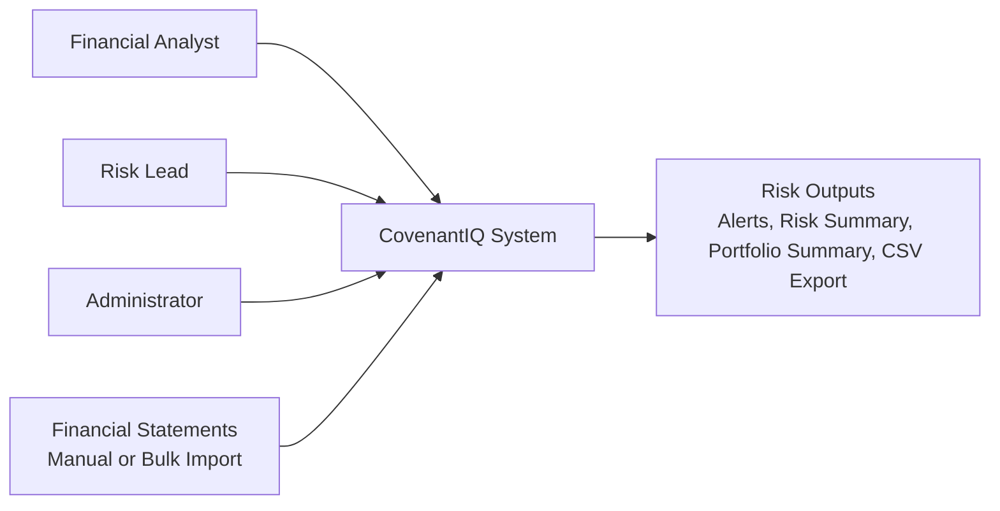
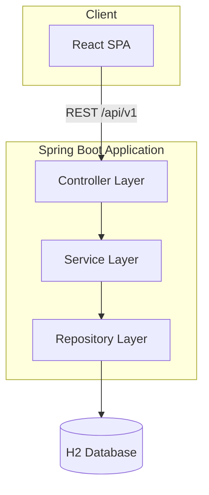
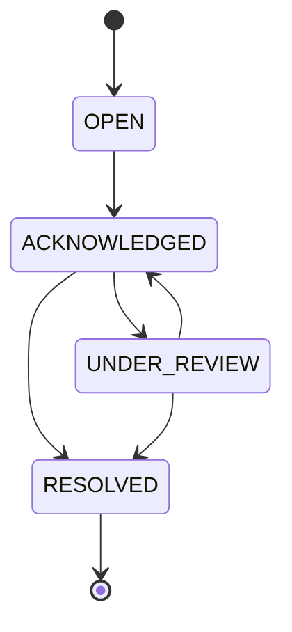

# CovenantIQ - Technical Design Document
**Talal Alhawaj**

---

## Table of Contents
1. Executive Summary  
2. Technical Objectives  
3. Design Principles  
4. Scope  
5. System Context Diagram  
6. Technology Stack  
7. High Level Architecture Overview  
8. Component Design  
9. Data Model Design  
10. API Design  
11. Security Design  
12. Non-Functional Design  
13. Deployment & Operations  
14. Testing Strategy  
15. Assumptions  
16. Risks & Mitigation  
17. Success Criteria  

---

## 1. Executive Summary
CovenantIQ is a layered, full-stack risk surveillance platform for automated covenant monitoring, alerting, and portfolio visibility.

This Technical Design Document translates the business scope in `FinalBRD.md` into an implementable architecture, covering both:
- Current implemented baseline (Phase 1 + partial Phase 2)  
- Planned target-state enhancements from `.kiro/specs/covenantiq-phase-2-enhancements`  

The design prioritizes deterministic financial calculations, transactional consistency, auditable alert workflows, and secure access control.

---

## 2. Technical Objectives
The technical objectives of CovenantIQ are to:

- Implement a clear separation of concerns across API, business logic, and persistence layers.  
- Execute financial statement submission, covenant evaluation, and alert generation atomically.  
- Ensure financial precision using `BigDecimal` arithmetic and controlled rounding.  
- Support role-based access control with stateless JWT authentication.  
- Provide standardized API contracts and RFC7807-compliant error responses.  
- Support enterprise observability through health checks, structured logs, and correlation IDs.  
- Maintain a deployment model that is simple today (single container) and extensible tomorrow (external DB, scale-out).  

---

## 3. Design Principles
1. **Layered Architecture**  
   Controllers manage transport concerns, services manage business rules, repositories manage data access.

2. **Deterministic Financial Logic**  
   Ratio calculations are centralized, reproducible, and precision-controlled.

3. **Transactional Integrity**  
   Statement ingestion and downstream evaluation/alerting are committed or rolled back as one unit.

4. **Auditability and Traceability**  
   Supersession model, alert lifecycle metadata, and correlation IDs preserve historical transparency.

5. **Secure-by-Default APIs**  
   Protected endpoints require authenticated principals with role-based authorization.

6. **Phased Delivery**  
   Baseline capabilities are production-usable while Phase 2 enhancements extend depth and governance.

---

## 4. Scope
### 4.1 In Scope (Target Technical Design)
#### A. Core Risk Surveillance
- Loan CRUD lifecycle with closure controls
- Covenant definition and threshold enforcement
- Financial statement ingestion and version supersession
- Automated covenant evaluation and breach alert generation
- Early warning detection rules

#### B. Risk Reporting and Oversight
- Loan-level risk summary and risk detail views
- Portfolio-level aggregation for active loans
- CSV export for alerts and covenant results

#### C. Security and Governance
- JWT login/refresh token flow
- Role-based authorization (`ANALYST`, `RISK_LEAD`, `ADMIN`)
- Alert lifecycle transitions with role checks and resolution notes
- RFC7807 error responses with correlation metadata

#### D. Platform Operations
- JSON structured logs
- Correlation ID propagation
- Health endpoint exposure (`/actuator/health`)

#### E. Planned Phase 2 Enhancements from `.kiro`
- Additional covenant types (DSCR, Interest Coverage, TNW, Debt-to-EBITDA, FCCR, Quick Ratio)
- Bulk import (CSV/Excel)
- Document attachments (PDF)
- Collaboration (comments/activity logging)

### 4.2 Out of Scope
- Loan origination and payment processing
- Core banking system integration
- Regulatory capital reporting
- Predictive AI/ML scoring in current release
- Multi-tenant architecture

---

## 5. System Context Diagram
**Description:**  
The platform accepts financial data from analyst workflows, evaluates covenants, and exposes risk outputs to monitoring roles.

---

## 6. Technology Stack
### Backend
- Java 21
- Spring Boot 3.3.x (`Web`, `Data JPA`, `Security`, `Validation`, `Actuator`)
- H2 (current runtime datastore)
- JWT (`jjwt`) with HS256 signing
- Logback + `logstash-logback-encoder`
- Springdoc OpenAPI

### Frontend
- React 18 + TypeScript + Vite
- Tailwind CSS
- Recharts

### Deployment
- Docker single-container deployment
- Spring Boot serves API and static SPA assets

---

## 7. High Level Architecture Overview
CovenantIQ uses a layered web architecture with a React SPA frontend and a Spring Boot backend.

### 7.1 Request Processing Pattern
1. Request enters controller and DTO validation executes.  
2. Security filters enforce JWT auth (except allowed routes).  
3. Service layer applies business rules and transaction boundaries.  
4. Repository layer persists/fetches entities via JPA.  
5. Response mapper returns API-safe DTOs.  
6. Exceptions are normalized to RFC7807 problem responses.

---

## 8. Component Design
### 8.1 Implemented Core Components
- `LoanService`: loan creation, retrieval, closure, active-loan validation  
- `CovenantService`: covenant creation with uniqueness enforcement  
- `FinancialStatementService`: statement submission, period validation, supersession graph handling  
- `CovenantEvaluationService`: ratio evaluation, breach decisioning, breach alert creation  
- `TrendAnalysisService`: consecutive-decline and near-threshold warning rules  
- `AlertService`: alert creation and lifecycle status transitions  
- `RiskSummaryService`: loan-level risk summary and covenant-level detail aggregation  
- `PortfolioSummaryService`: portfolio risk roll-up metrics  
- `ExportService`: alerts/covenant-results CSV export generation  
- `AuthService` + security filters: login, refresh, JWT claims parsing, lockout policy

### 8.2 Planned Components (from `.kiro`)
- `BulkImportService` (CSV/Excel parsing + row-level validation reporting)  
- `DocumentStore` (PDF attachment storage/retrieval)  
- `ActivityLogger` (domain event audit feed + retention policy)  
- `CommentService` (loan collaboration notes)  
- Enhanced early warning detectors (volatility, seasonal anomaly)

### 8.3 Alert Lifecycle State Model

Lifecycle governance rules:
- `OPEN` must be acknowledged before review/resolution.
- `RESOLVED` alerts cannot move back to earlier states.
- Resolution requires `resolutionNotes`.
- Role-based authorization is enforced per target state.

---

## 9. Data Model Design
### 9.1 Implemented Entities
| Entity | Purpose | Key Fields |
|-------|---------|------------|
| `Loan` | Borrower exposure record | borrowerName, principalAmount, startDate, status |
| `Covenant` | Loan covenant constraint | type, thresholdValue, comparisonType, severityLevel |
| `FinancialStatement` | Periodic financial input | periodType, fiscalYear, fiscalQuarter, currentAssets, currentLiabilities, totalDebt, totalEquity, ebit, interestExpense, superseded |
| `CovenantResult` | Evaluation outcome | actualValue, status, evaluationTimestampUtc, superseded |
| `Alert` | Risk event | alertType, message, severityLevel, alertRuleCode, status, acknowledgedBy/At, resolvedBy/At, resolutionNotes, superseded |
| `UserAccount` | Auth principal | username, passwordHash, rolesCsv, active, failedLoginAttempts, lockoutUntilUtc |

### 9.2 Implemented Constraints and Rules
- Unique covenant per loan/type: `(loan_id, type)`  
- Statement supersession for duplicate period submissions  
- Cascaded supersession of prior `CovenantResult` and `Alert` artifacts  
- UTC timestamp normalization for submission/evaluation/alert timestamps

### 9.3 Planned Data Extensions
- Extended financial statement fields for advanced covenant formulas  
- Separate user-role relational model (User, Role, UserRole)  
- Attachment, Comment, and ActivityLog entities

---

## 10. API Design
### 10.1 Core Endpoints
- `POST /api/v1/loans`  
- `GET /api/v1/loans`  
- `GET /api/v1/loans/{id}`  
- `PATCH /api/v1/loans/{id}/close`  
- `POST /api/v1/loans/{loanId}/covenants`  
- `POST /api/v1/loans/{loanId}/financial-statements`  
- `GET /api/v1/loans/{loanId}/covenant-results`  
- `GET /api/v1/loans/{loanId}/alerts`  
- `GET /api/v1/loans/{loanId}/risk-summary`  
- `GET /api/v1/loans/{loanId}/risk-details`  
- `PATCH /api/v1/alerts/{alertId}/status`  
- `GET /api/v1/portfolio/summary`  
- `GET /api/v1/loans/{loanId}/alerts/export`  
- `GET /api/v1/loans/{loanId}/covenant-results/export`  
- `POST /api/v1/auth/login`  
- `POST /api/v1/auth/refresh`

### 10.2 Error Contract
API errors use `application/problem+json` with:
- `title`
- `status`
- `detail`
- `instance`
- `timestamp`
- `correlationId` (when present)

### 10.3 Planned API Surface (Phase 2)
- Bulk import endpoints
- Attachment upload/download endpoints
- Comment CRUD endpoints
- Activity log retrieval endpoints
- User management endpoints

---

## 11. Security Design
### Authentication
- Access token + refresh token pattern
- Token claims include subject, user ID, roles, token type
- Access token TTL: 60 minutes
- Refresh token TTL: 7 days

### Authorization
- Spring method-level authorization via `@PreAuthorize`
- Role model:
  - `ANALYST`: create/maintain loans/covenants/statements; acknowledge alerts
  - `RISK_LEAD`: read access + review/resolve alerts + portfolio access
  - `ADMIN`: administrative superset

### Account Protection
- BCrypt password hashing (cost factor 12)
- Failed login counter with lockout after threshold violations

### Security Notes
- Backend security is implemented.
- Frontend token-integration remains planned; current frontend still uses demo session auth.

---

## 12. Non-Functional Design
### Performance Targets
- Loan risk summary: <= 500 ms  
- Portfolio summary: <= 2 s (up to 1000 active loans)  
- Statement submission + evaluation: <= 1 s

### Reliability and Consistency
- Transactional write flows for statement processing
- No partial commits for evaluation/alert generation

### Accuracy
- `BigDecimal` arithmetic for financial ratios
- Controlled rounding policy

### Observability
- JSON logs with contextual metadata
- Correlation ID filter with `X-Correlation-ID` propagation
- `/actuator/health` enabled for runtime checks

### Maintainability
- Layered package structure and DTO boundaries
- Clear service decomposition by business domain

---

## 13. Deployment & Operations
### Current Deployment Model
- Single Spring Boot runtime container
- Embedded H2 database for simplified deployment/demo mode
- Static SPA served by backend

### Operational Endpoints
- API docs: `/swagger-ui.html`
- Health check: `/actuator/health`

### Configuration Controls
- `app.security.enabled`
- `app.jwt.secret`
- `app.jwt.access-token-minutes`
- `app.jwt.refresh-token-days`

### Planned Operational Evolution
- External production database (PostgreSQL/MySQL)
- Database migration tooling (Flyway/Liquibase)
- Expanded monitoring and retention policies

---

## 14. Testing Strategy
### Implemented Testing
- Unit tests for ratio and evaluation services
- Backend integration flow tests (`LoanFlowIntegrationTest`)

### Target Testing Coverage
- Service-level tests for all covenant types and alert transitions
- Integration tests for auth lifecycle and export endpoints
- Property-based tests for financial math and parser correctness (per `.kiro` plan)
- Frontend component and API contract tests

### Quality Gates
- >= 80% line coverage target for business logic modules
- 100% pass on critical-path tests:
  - Ratio calculations
  - Covenant comparison logic
  - Alert lifecycle transitions
  - Auth and RBAC checks

---

## 15. Assumptions
1. Financial statement values are pre-validated by upstream business processes.
2. Initial workloads are within low-to-mid hundreds of active loans.
3. Core product focus remains post-disbursement risk surveillance.
4. JWT secrets and environment configuration are managed securely by deployment owners.
5. Frontend auth migration to JWT will be completed in Phase 2 execution.

---

## 16. Risks & Mitigation
### Auth Experience Mismatch Risk
**Impact:** Medium | **Likelihood:** Medium  
Backend JWT/RBAC is live while frontend still runs demo-session auth.  
Mitigation: prioritize frontend token integration and role-aware UI controls.

### Data Growth and In-Memory DB Risk
**Impact:** High | **Likelihood:** Medium  
H2 in-memory storage is not suitable for production persistence at scale.  
Mitigation: migrate to PostgreSQL/MySQL with migration scripts and backup strategy.

### Alert Noise Risk
**Impact:** Medium | **Likelihood:** Medium  
Rule-only warnings can increase analyst fatigue.  
Mitigation: severity calibration, filtering, and phased rule tuning (including volatility/seasonal logic).

### Security Configuration Risk
**Impact:** High | **Likelihood:** Low  
Weak secrets or improper environment controls can compromise token security.  
Mitigation: enforce secret rotation, environment hardening, and security validation in CI.

---

## 17. Success Criteria
### Technical Delivery
- All BRD in-scope APIs are implemented and documented.
- Frontend and backend authentication models are unified under JWT.
- Alert lifecycle governance is fully enforced with role controls.

### Performance and Reliability
- Risk summary, portfolio summary, and statement processing meet target latencies.
- No partial-write failures on evaluation transactions.
- Health endpoint remains stable and responsive.

### Governance and Auditability
- Standardized problem responses include trace metadata.
- Alert state transitions preserve actor/timestamp metadata.
- Structured logs support request-level traceability.

### Scalability Readiness
- Database migration path is execution-ready.
- Planned Phase 2 components have concrete interfaces and test strategy defined.

Achievement of these criteria confirms technical readiness for enterprise-grade covenant monitoring operations.

---
