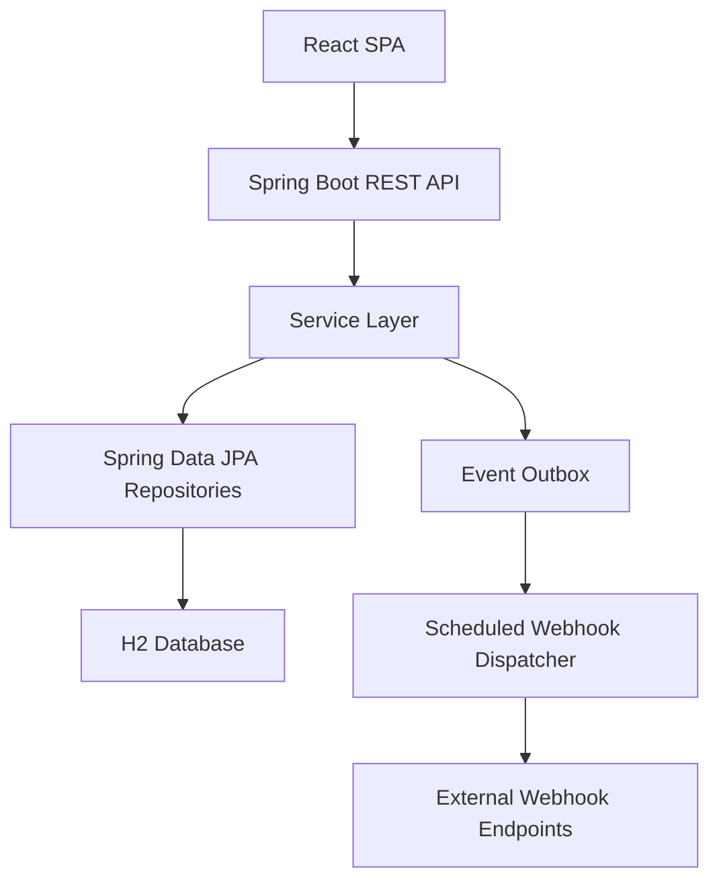

# CovenantIQ Technical Design Document
## Current-State Edition

Date: 2026-03-10

## 1. Purpose
This document describes the technical design represented by the current codebase in this repository as of March 10, 2026. It reflects implemented architecture and runtime behavior rather than a future-state design.

## 2. System Overview
CovenantIQ is a full-stack web application composed of:
- a Spring Boot backend exposing REST APIs under `/api/v1`
- a React + TypeScript SPA frontend
- an H2-backed persistence layer accessed through Spring Data JPA
- JWT-based authentication and role-based authorization
- governance and integration modules layered on top of loan monitoring

## 3. Technology Stack

### Backend
- Java 21
- Spring Boot 3.3.8
- Spring Web
- Spring Security
- Spring Data JPA
- Spring Validation
- Spring Actuator
- H2 database
- JJWT 0.12.6
- OpenCSV 5.9
- Apache POI 5.3.0
- springdoc OpenAPI UI 2.6.0
- Logback with logstash encoder

### Frontend
- React 18
- TypeScript 5.8
- Vite 5
- React Router 6
- Tailwind CSS 3
- Recharts
- Playwright

## 4. Runtime Modes
Backend runtime mode is controlled by `app.mode.*` properties.

- `NORMAL`
  - security enabled by default
  - strict secret validation enabled
  - no sample-data assumption
- `DEMO`
  - sample content available
  - demo users and seeded portfolio data can be bootstrapped
- `TEST`
  - sample content available
  - intended for automated validation flows

The runtime config is exposed through `GET /api/v1/runtime-config` for frontend awareness.

## 5. High-Level Architecture

The application uses a layered structure:
- controllers handle transport and authorization boundaries
- services implement business rules and transactions
- repositories encapsulate persistence
- DTOs and response mappers isolate API contracts from entities

## 6. Core Functional Modules

### 6.1 Loan Monitoring
Primary controller: `LoanController`

Implemented responsibilities:
- loan CRUD-style operations except delete
- covenant creation, update, and retrieval
- financial statement submission
- statement bulk import for a specific loan
- loan comments
- covenant result queries
- alert queries
- risk summary and risk details
- CSV exports

### 6.2 Financial Evaluation
Primary services:
- `FinancialStatementService`
- `FinancialRatioService`
- `CovenantEvaluationService`
- `TrendAnalysisService`
- `RiskSummaryService`

Implemented covenant types:
- `CURRENT_RATIO`
- `DEBT_TO_EQUITY`
- `DSCR`
- `INTEREST_COVERAGE`
- `TANGIBLE_NET_WORTH`
- `DEBT_TO_EBITDA`
- `FIXED_CHARGE_COVERAGE`
- `QUICK_RATIO`

Early warning rules currently implemented:
- three consecutive current-ratio declines
- near-threshold detection
- current-ratio volatility
- seasonal anomaly detection for quarterly comparisons

### 6.3 Alerts and Workflow
Primary services:
- `AlertService`
- `WorkflowService`

Alert state governance is backed by workflow definitions and workflow instances. A default alert workflow is bootstrapped when enabled and supports:
- `OPEN`
- `ACKNOWLEDGED`
- `UNDER_REVIEW`
- `RESOLVED`

Transitions are controlled by allowed roles and can require fields such as `resolutionNotes`.

### 6.4 Rules and Change Governance
Primary services:
- `RulesetService`
- `ChangeControlService`

Rulesets:
- support creation, versioning, validation, and publication
- store JSON rule definitions
- record validation test cases
- record publication audits

Change control:
- supports change requests, change request items, releases, and rollbacks
- emits outbox events for release actions

### 6.5 Collaboration and Evidence
Primary services:
- `CommentService`
- `AttachmentService`
- `ActivityLogService`

Attachments:
- are stored in the database
- are limited to PDF content
- enforce a 10 MB maximum size

### 6.6 Collateral and Exceptions
Primary service:
- `CollateralExceptionService`

Capabilities:
- create/list collateral assets
- create/list covenant exceptions
- approve/expire exceptions

### 6.7 Integrations
Primary services:
- `WebhookIntegrationService`
- `OutboxEventPublisher`
- `OutboxDispatcherService`

Design:
- domain events are persisted in an event outbox table
- a scheduled dispatcher delivers matching events to active webhook subscriptions
- HMAC signatures are included on outbound payloads
- retries use exponential backoff and dead-letter status after max attempts

### 6.8 User and Auth Management
Primary services:
- `AuthService`
- `UserManagementService`
- `JwtService`
- `CustomUserDetailsService`

Capabilities:
- login and refresh token flows
- BCrypt password hashing
- role extraction from stored user account records
- admin-only user management

## 7. Security Design

### Authentication
- JWT access and refresh token flow
- stateless sessions
- frontend stores session data locally and refreshes on 401 where applicable

### Authorization
- URL-level protection for `/api/v1/**`
- method-level authorization via `@PreAuthorize`
- supported roles:
  - `ANALYST`
  - `RISK_LEAD`
  - `ADMIN`

### Public Endpoints
- `/api/v1/auth/**`
- `/api/v1/runtime-config`
- `/actuator/health`
- `/swagger-ui/**`
- `/v3/api-docs/**`
- SPA assets and login routes
- `/h2-console/**`

### Environment Protection
`RuntimeModeValidator` prevents normal-mode startup with placeholder JWT and webhook encryption secrets.

## 8. API Surface Summary

### Authentication
- `POST /api/v1/auth/login`
- `POST /api/v1/auth/refresh`

### Runtime / Ops
- `GET /api/v1/runtime-config`
- `GET /actuator/health`
- `GET /swagger-ui.html`

### Loans
- `POST /api/v1/loans`
- `GET /api/v1/loans`
- `GET /api/v1/loans/{id}`
- `PATCH /api/v1/loans/{id}/close`
- `POST /api/v1/loans/{loanId}/covenants`
- `PATCH /api/v1/loans/{loanId}/covenants/{covenantId}`
- `GET /api/v1/loans/{loanId}/covenants`
- `POST /api/v1/loans/{loanId}/financial-statements`
- `POST /api/v1/loans/{loanId}/financial-statements/bulk-import`
- `POST /api/v1/loans/{loanId}/comments`
- `GET /api/v1/loans/{loanId}/comments`
- `DELETE /api/v1/loans/{loanId}/comments/{commentId}`
- `GET /api/v1/loans/{loanId}/covenant-results`
- `GET /api/v1/loans/{loanId}/alerts`
- `GET /api/v1/loans/{loanId}/risk-summary`
- `GET /api/v1/loans/{loanId}/risk-details`
- `GET /api/v1/loans/{loanId}/alerts/export`
- `GET /api/v1/loans/{loanId}/covenant-results/export`

### Alerts
- `PATCH /api/v1/alerts/{alertId}/status`

### Portfolio
- `GET /api/v1/portfolio/summary`

### Attachments
- `POST /api/v1/financial-statements/{id}/attachments`
- `GET /api/v1/financial-statements/{id}/attachments`
- `GET /api/v1/attachments/{id}`
- `DELETE /api/v1/attachments/{id}`

### Activity
- `GET /api/v1/loans/{loanId}/activity`
- `GET /api/v1/activity`

### Collateral and Exceptions
- `POST /api/v1/loans/{loanId}/collaterals`
- `GET /api/v1/loans/{loanId}/collaterals`
- `POST /api/v1/loans/{loanId}/exceptions`
- `GET /api/v1/loans/{loanId}/exceptions`
- `PATCH /api/v1/exceptions/{id}/approve`
- `PATCH /api/v1/exceptions/{id}/expire`

### Rulesets
- `POST /api/v1/rulesets`
- `POST /api/v1/rulesets/{id}/versions`
- `POST /api/v1/rulesets/{id}/versions/{version}/validate`
- `POST /api/v1/rulesets/{id}/versions/{version}/publish`
- `GET /api/v1/rulesets`
- `GET /api/v1/rulesets/{id}/versions`

### Workflows
- `POST /api/v1/workflows/definitions`
- `GET /api/v1/workflows/definitions`
- `POST /api/v1/workflows/definitions/{id}/publish`
- `GET /api/v1/workflows/instances/{entityType}/{entityId}`
- `POST /api/v1/workflows/instances/{id}/transition`

### Change Control
- `POST /api/v1/change-requests`
- `PATCH /api/v1/change-requests/{id}/approve`
- `GET /api/v1/change-requests`
- `POST /api/v1/releases`
- `POST /api/v1/releases/{id}/rollback`
- `GET /api/v1/releases`

### Webhook Integrations
- `POST /api/v1/integrations/webhooks`
- `GET /api/v1/integrations/webhooks`
- `PATCH /api/v1/integrations/webhooks/{id}`
- `GET /api/v1/integrations/webhooks/{id}/deliveries`
- `POST /api/v1/integrations/webhooks/deliveries/{eventOutboxId}/retry`

### User Administration
- `POST /api/v1/users`
- `GET /api/v1/users`
- `GET /api/v1/users/{id}`
- `PATCH /api/v1/users/{id}/roles`
- `DELETE /api/v1/users/{id}`

### Admin Loan Imports
- `POST /api/v1/admin/loan-imports/preview`
- `POST /api/v1/admin/loan-imports/{batchId}/execute`
- `GET /api/v1/admin/loan-imports`
- `GET /api/v1/admin/loan-imports/{batchId}`
- `GET /api/v1/admin/loan-imports/{batchId}/rows`

## 9. Data Model Summary
Implemented domain entities include:
- `Loan`
- `Covenant`
- `FinancialStatement`
- `CovenantResult`
- `Alert`
- `Comment`
- `Attachment`
- `CollateralAsset`
- `CollateralValuation`
- `CovenantException`
- `ActivityLog`
- `UserAccount`
- `Ruleset`
- `RulesetVersion`
- `RulesetTestCase`
- `RulesetPublishAudit`
- `ChangeRequest`
- `ChangeRequestItem`
- `ReleaseBatch`
- `ReleaseAudit`
- `WorkflowDefinition`
- `WorkflowState`
- `WorkflowTransition`
- `WorkflowInstance`
- `WorkflowTransitionLog`
- `WebhookSubscription`
- `WebhookDelivery`
- `EventOutbox`
- `LoanImportBatch`
- `LoanImportRow`

Notable model behaviors:
- superseded financial statements/results/alerts are retained for history
- workflow state is modeled explicitly rather than only as alert-status fields
- webhook deliveries are tracked separately from outbox records
- ruleset versions, releases, and workflow definitions support governance history

## 10. Frontend Design
The frontend is a route-based SPA under `/app` with protected pages for:
- dashboard
- portfolio
- loans and nested loan-detail tabs
- alerts
- integrations
- workflows
- policy studio
- change control
- reports
- settings
- admin users
- admin loan imports

Auth behavior:
- login uses backend auth endpoints
- tokens are persisted in local storage
- role-aware route guards are implemented with `ProtectedRoute`

The frontend API client centralizes:
- token injection
- automatic refresh attempts
- RFC 7807 error handling
- multipart upload handling

## 11. Error Handling and Observability
- API failures use `application/problem+json`
- global exception handling maps domain exceptions to structured problem responses
- correlation IDs are propagated via `CorrelationIdFilter`
- logback is configured for structured logging
- actuator health is enabled

## 12. Seed Data and Demo Behavior
When sample content is enabled:
- demo users for analyst, risk lead, and admin roles are created
- seeded portfolio data includes multiple loans, covenants, statements, alerts, and comments
- default ruleset and default alert workflow can be bootstrapped automatically

## 13. Testing Footprint
The repository currently contains:
- unit tests for financial ratios, trend analysis, alert service, auth, workflow, change control, exports, portfolio summary, risk summary, webhook secret handling, and loan import services
- integration tests for loan flow, covenant management, alert lifecycle, auth flow, RBAC, attachments, comments/activity, bulk import, additional covenant types, enhanced early warning, user management, health endpoint, and loan import
- Playwright E2E coverage for auth, dashboard, loans, alerts, governance/admin flows, reports/settings, and loan import workflows

## 14. Technical Constraints and Gaps
- H2 with `ddl-auto=update` is convenient for development but not a production persistence strategy.
- Attachments are stored in the database rather than external object storage.
- Webhook delivery is synchronous from the dispatcher process and depends on outbound network availability.
- The system is single-instance by default; no distributed scheduler coordination is implemented.

## 15. Current-State Conclusion
The implemented codebase is a broader operational surveillance platform than the earlier project docs suggest. It combines covenant monitoring, user-facing analyst tooling, governance controls, and outbound integration delivery in a single Spring Boot + React application baseline.
